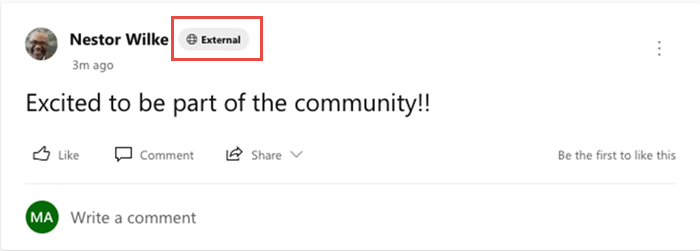
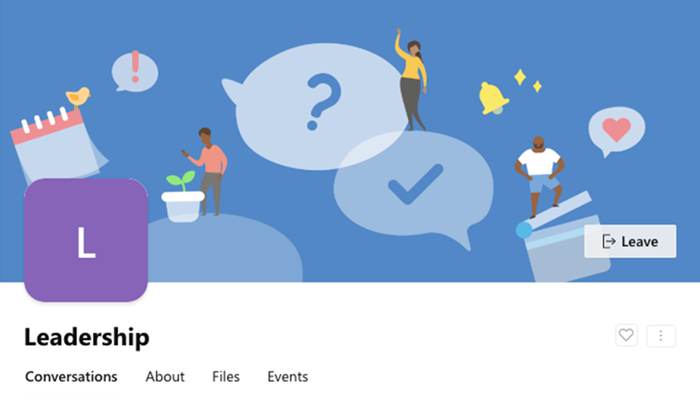

# Work with Azure Active Directory-B2B guests in Yammer communities

The Yammer guest feature allows organizations to call in experts such as vendors, suppliers, or consultants from outside the organization to supercharge collaboration. Yammer networks aligned to native mode use the Azure Active Directory Business-Business (Azure AD-B2B) guest framework to power guests. Azure Active Directory (Azure AD)-B2B is a secure, compliant external collaboration framework. Many apps in the Microsoft 365 suite use Azure AD (for example, Microsoft SharePoint, Microsoft Outlook, and Microsoft Teams). 

Any Microsoft 365 user who isn't part of your organization can be added as a guest to a Yammer community by a Community admin. AzureAD-B2B guests in Yammer communities are covered by the same compliance and auditing protection as the rest of Microsoft 365 and can be managed within Azure AD. Guest access is subject to Azure AD and Microsoft 365 or Office 365 service limits.

## Prerequisites for adding an external user as AzureAD-B2B guest to a Yammer community

A Yammer network should be aligned to native mode before inviting an external user as an AzureAD-B2B guest to a Yammer community. Inviting a guest requires configuring settings in Yammer and other Microsoft 365 services, including settings in Azure AD, Microsoft 365 Groups, and SharePoint. 

If your organization is ready to start inviting guests to Yammer communities, then configure the following settings.

Yammer network admins need to enable guest access on their networks from **Yammer network admin settings > Security settings > External Messaging**.

> [!div class="mx-imgBorder"]
> 

This setting is a Yammer network-wide setting. Enabling guest access here allows community admins to add guests to any Yammer community in the network. You can control guest access to individual Yammer communities by using sensitivity labels.

External collaboration is a key ingredient for the success of any organization. Yammer guests allow you to call in experts, such as consultants or vendors, from outside your organization. Users can invite guests to a community and quickly start a rich conversation by sharing access to community resources like files. This ease-of-use makes external collaboration one of the most used features in Yammer today.

This setting is a Yammer network-wide setting. Enabling guest access lets community admins add guests to any Yammer community in the network. You can control guest access to individual Yammer communities [by using sensitivity labels](/microsoft-365/compliance/sensitivity-labels-teams-groups-sites).

> [!NOTE]
> If your Yammer network is provisioned after December 15th, 2020, then AzureAD-B2B guest functionality is already enabled by default for your organization. 

To configure Azure AD, Microsoft 365 Groups, and SharePoint settings, see [Collaborate with guests in a team](/microsoft-365/solutions/collaborate-as-team) .

## How to invite an external user as guest to a Yammer community

1.	A community admin can add a guest to a Yammer community by entering the email address of the guest in the **Add Member** panel of the community. 

2.	The guest receives a welcome email message. This message includes information about the Yammer community and Yammer network to which the user is being invited, and the name of the community admin inviting the guest. The guest must accept the invitation by selecting **Go To Community** in the email message before accessing the Yammer community.

    

3.	By visiting the **Go to Community** link, the guest accepts the invitation. After a guest accepts the invitation, they can participate in the Yammer community.

4. Network switcher located in the suite header can be used to switch between the home Yammer network, any Yammer networks the user is a guest in and External networks.

    

5.	Everyone in the Yammer community can identify easily who is a guest. An External badge appears next to the guest in Yammer community posts, comments, community membership page, and search results. The Yammer community with guests will have a Globe icon next to it. 

    

    The Yammer community with guests will have a Globe icon next to it.

    

6. Guests can leave the Yammer community at any time by hovering over the Joined button in the community header.

     

    > [!NOTE]
    > Leaving the Yammer community doesn't remove the guest account from your organization's directory. This must be done by a Microsoft 365 global admin or an Azure AD admin.

## Guest user capabilities and limitations

The guest experience has limitations by design. Following is a list of limitations that applies to AzureAD-B2B guests in Yammer communities. 

- Guests cannot discover communities. Guests can access only the communities that they are invited into. 

- Guests cannot create new communities in the network they are invited to. 

- A guest can't be a community admin, nor can they change community settings like these:
  - Adding new members to the community and removing membership
  - Promoting and demoting the owners
  - Editing community info
  - Adding related groups
  - Adding connectors 
  - Adding pinned files or links (they can view the pinned files and links)
  - Viewing community or group insights

## Licensing for guest access

Guest access is included with all Microsoft 365 Business Standard, Microsoft 365 Enterprise, and Microsoft 365 Education subscriptions. No other Microsoft 365 license is necessary. Yammer doesn't restrict the number of guests you can add. However, the paid features of Azure AD restrict the total number of guests you can add to your tenant. For more information, see [Billing model for Azure AD External Identities](/azure/active-directory/external-identities/external-identities-pricing).

## What features are not supported for Guests?

We are working hard to bring all Yammer functionality to the new B2B guests in Yammer. Below is the list of features still in progress:
- **Personal email, non-Microsoft 365 business email, and phone number-based legacy accounts** – Users with Microsoft 365 Business email accounts can be added as guests. Other email domains like Gmail or Yahoo mail etc. will not be supported in this release. 
- **Private messages** – Private messages are disabled for B2B guests in Yammer.
- **Live events** – Currently guest users will not be able to participate in live events because guests aren't yet supported by Microsoft Stream. To learn more about when these features will be available, see the [Microsoft Yammer roadmap](https://go.microsoft.com/fwlink/?linkid=2132131).
-	**Adding guests during community creation** – Community owners can invite guest users by using edit membership flow for any community. In the current release, community owners will not be able to add guest emails at the time of community creation.
- **Interactive Yammer email notifications in Outlook** – Interactive email notifications for B2B guests users aren't available in this preview. B2B Guest users can expect to receive the legacy email notifications from the communities that they are added to as guests, instead of the new interactive email notifications. In the communities where these users are not guests, the interactive email notifications function as expected.
- **Addition of Guests to the All Company community** – Guests cannot be added to the All Company community.

## FAQ

**Q: Is AzureAD-B2B guest experience in Yammer available for customers that have a Yammer network with EU data residency?**
A: Yes!

**Q: Can we invite AzureAD-B2B guests to Yammer External Networks?**

A: AzureAD-B2B guests cannot be invited to Yammer External Networks. External Networks work as-is with Yammer guest access.

**Q: Will Yammer guest settings be aligned to Microsoft 365 Groups settings?**

A: Yes. With Native Mode for Microsoft 365 for Yammer, all communities and users are supported via Microsoft 365 Groups. The Azure AD guest settings for Microsoft 365 Groups apply to Yammer communities.

**Q: Can Yammer have dynamic membership groups include guests from a domain?**

A: Yes. Admins can create dynamic membership rules for guest users in a Yammer community via Azure portal. An example is: **user.userType -eq "Guest"** and user.email **-contains "@xyz.com"** - this rule will add all guest users from the domain xyz.com to the specified Yammer community.

**Q: I don’t want to allow guests in the Yammer communities of our network. How do I disable external users from participating in our communities?**

A: Yammer relies on and builds upon the [external collaboration settings](/azure/active-directory/external-identities/delegate-invitations) offered by Azure AD. We recommend that you use Azure AD controls to configure external collaboration settings.

You can prevent external users from being added to Yammer communities while allowing them to access the rest of Microsoft 365 apps. Go to the Yammer network admin settings page > External messaging security setting to deny community admins from adding external users.

> [!NOTE]
> When you deny external users from being added to Yammer communities, community admins won't be able to add any new external users to the Yammer communities. Existing external users won't be removed from Yammer communities.

**Q: Does the AzureAD-B2B guest experience allow cross-geo guest access?**

A: Yes. AzureAD-B2B guests from another Geo can be invited to a Yammer network in Native mode. However, if a tenant migrates to another geo, the existing guest access doesn't automatically change to cross-geo guest access. All guest access must be renewed (that is, the host must issue new invites and guests must accept them) after a cross-geo tenant migration.

## Related articles

[Yammer Blog](https://techcommunity.microsoft.com/t5/yammer-blog/bg-p/YammerBlog)

[Yammer admin Help](./admin-key-concepts.md)

[Native Mode for Microsoft 365 for Yammer](../configure-your-yammer-network/overview-native-mode.md)

[Yammer Help and Support Center for end-users](https://support.office.com/yammer)
