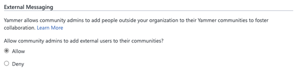
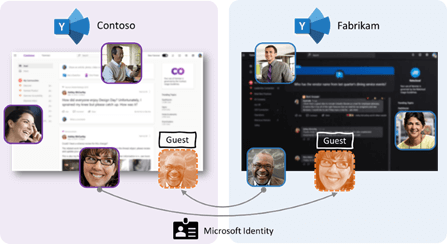

# Business-to-business (B2B) Guest support in Yammer Preview - Customer Terms and FAQ

Yammer guests allows organizations to call in experts such as vendors, suppliers or consultants from outside the organization to supercharge collaboration. Yammer networks aligned to native mode uses the Azure Active Directory Business-Business (AzureAD-B2B) guest framework to power guests. AzureAD-B2B is a secure, compliant external collaboration framework used by many apps in the Microsoft 365 suite like Microsoft SharePoint, Microsoft Outlook, and Microsoft Teams. 

Any Microsoft 365 user who is not part of your organization can be added as guest to a Yammer community by a Community admin.  AzureAD-B2B guests in Yammer communities are covered by the same compliance and auditing protection as the rest of Microsoft 365, and can be managed within Azure AD. Guest access is subject to Azure AD and Microsoft 365 or Office 365 service limits.

## Pre-requisites for adding an external user as AzureAD-B2B guest to a Yammer community

A Yammer network should be aligned to native mode before inviting an external user as a AzureAD-B2B guest to a Yammer community. Inviting a guest requires configuring settings in Yammer and other Microsoft 365 services, including settings in Azure AD, Microsoft 365 Groups, and SharePoint. 

If your organization is ready to start inviting guests to Yammer communities, then configure the following settings.

Yammer network admins need to enable guest access on their networks from **Yammer network admin settings > Security settings > External Messaging**

This is a Yammer network wide setting. Enabling guest access here will allow community admins to add guests to any Yammer community in the network. You can control guest access to individual Yammer communities by using sensitivity labels.

External collaboration is a key ingredient for the success of any organization. Yammer guests allow you to call in experts, such as consultants or vendors, from outside your organization. Users can invite guests to a community and quickly start a rich conversation by sharing access to community resources like files. This ease-of-use makes external collaboration one of the most used features in Yammer today.

This is a Yammer network wide setting. Enabling guest access here will allow community admins to add guests to any Yammer community in the network. You can control guest access to individual Yammer communities [by using sensitivity labels](https://docs.microsoft.com/microsoft-365/compliance/sensitivity-labels-teams-groups-sites).

> [!NOTE]
> If your Yammer network is provisioned after December 15th, 2020, then AzureAD-B2B guest functionality is already enabled by default for your organization. 

To configure Azure AD, Microsoft 365 Groups and SharePoint settings, see [Collaborate with guests in a team](https://docs.microsoft.com/microsoft-365/solutions/collaborate-as-team) .

## How to invite an external user as guest to a Yammer community

1.	A community admin can add a guest to a Yammer community by entering the email address of the guest in the **Add Member** panel of the community. 

2.	The guest receives a welcome email message. This message includes information about the Yammer community and Yammer network to which the user is being invited to, as well as the name of the community admin inviting the guest. The guest must accept the invitation by selecting **Go To Community** in the email message before accessing the Yammer community.

    

3.	By visiting the **Go to Community** link, the guest accepts the invitation. After accepting the invitation, the guest can  participate in the Yammer community they are invited to.

4. Network switcher located in the suite header can be used to switch between the home Yammer network, any Yammer networks the user is a guest in and External networks.

    

5.	Everyone in the Yammer community can identify easily who is a guest. An External badge appears next to the guest in Yammer community posts, comments, community membership page, and search results. The Yammer community with guests will also have a Globe icon next to it. 

    

    The Yammer community with guests will also have a Globe icon next to it.

    

6. Guests can leave the Yammer community at any time by hovering over the Joined button in the community header.

     

    > [!NOTE]
    > Leaving the Yammer community doesn't remove the guest account from your organization's directory. This must be done by a Microsoft 365 global admin or an Azure AD admin.

## Guest user capabilities and limitations

The guest experience has limitations by design. Following is a list of limitations that applies to AzureAD-B2B guests in Yammer communities. 

- Guests cannot discover communities. Guests can access only the communities that they are invited into. 

- Guests cannot create new communities in the network they are invited to. 

- Guests cannot be a community admin and cannot change community settings. This includes:
   -  Adding new members to the community and removing membership
  - Promoting and demoting the owners
  - Editing community info
  - Adding related groups
  - Adding connectors 
  - Adding pinned files or links (they can view the pinned files and links)
  - Viewing community or group insights

## Licensing for guest access

Guest access is included with all Microsoft 365 Business Standard, Microsoft 365 Enterprise, and Microsoft 365 Education subscriptions. No additional Microsoft 365 license is necessary. Yammer doesn't restrict the number of guests you can add. However, the total number of guests that can be added to your tenant may be restricted by the paid features of Azure AD. For more information, see [Billing model for Azure AD External Identities](https://docs.microsoft.com/azure/active-directory/external-identities/external-identities-pricing).

We are workingWhat features are not supported for Guests?

We are working hard to bring all Yammer functionality to the new B2B guests in Yammer. Below is the list of features still in progress:
- **Personal email, non-Microsoft 365 business email, and phone number-based legacy accounts** – Users with Microsoft 365 Business email accounts can be added as guests. Other email domains like Gmail or Yahoo mail etc. will not be supported in this release. 
- **Cross-Geography guests** – Today we enable organizations to host Yammer in two data centers – Europe and North America. With this new guest support, users will be able to add guests from their same geography. Please check [the Yammer public roadmap](https://go.microsoft.com/fwlink/?linkid=2132131) to see timelines for Cross-Geography support.

- **Private messages** – Private messages are disabled for B2B guests in Yammer.
- **Live events** – Currently guest users will not be able to participate in live events because guests are not yet supported by Microsoft Stream. To learn more about when these features will be available, please refer to our [Microsoft Yammer roadmap](https://go.microsoft.com/fwlink/?linkid=2132131).
-	**Adding guests during community creation** – Community owners can invite guest users by using edit membership flow for any community. In the current release, community owners will not be able to add guest emails at the time of community creation. This is a temporary limitation and will be addressed in the subsequent releases.
- **Interactive Yammer email notifications in Outlook** – Interactive email notifications for B2B guests users will not be available in this preview. B2B Guest users will continue to receive the legacy email notifications from the communities that they are added to as guests, instead of the new interactive email notifications. For the communities these users are not guests in, the interactive email notifications will work as usual. The interactive email notifications for guest users will be supported in subsequent releases.
- **Addition of Guests to the All Company community** – Guests cannot be added to the All Company community.

## FAQ

**Q: Is AzureAD-B2B guest experience in Yammer available for customers that have a Yammer network with EU data residency?**
A: Yes!

**Q: Can we invite AzureAD-B2B guests to Yammer External Networks?**

A: AzureAD-B2B guests cannot be invited to Yammer External Networks. External Networks will continue to work as-is with Yammer guest access.

**Q: Will Yammer guest settings be aligned to Microsoft 365 Groups settings?**

A: Yes. With Native Mode for Microsoft 365 for Yammer, all communities and users are supported via Microsoft 365 Groups. The AAD guest settings for Microsoft 365 Groups will now also apply to Yammer communities.

**Q: Can Yammer have dynamic membership groups include guests from a domain?**

A: Yes. Admins can create dynamic membership rules for guest users in a Yammer community via Azure portal. An example is: **user.userType -eq "Guest"** and user.email **-contains "@xyz.com"** - this rule will add all guest users from the domain xyz.com to the specified Yammer community.

****Q: I don’t want to allow guests in the Yammer communities of our network. How do I disable external users from participating in our communities?**

A: Yammer relies on and builds upon the [external collaboration settings](https://docs.microsoft.com/azure/active-directory/external-identities/delegate-invitations) offered by Azure AD. We recommend that you use Azure AD controls to configure external collaboration settings.

If you want to deny external users from being added to Yammer communities while allowing external users to access the rest of Microsoft 365 apps, use the External messaging security settings in the Yammer network admin settings page to deny community admins from adding external users.

> [!NOTE]
> When you deny external users from being added to Yammer communities, community admins will not be able to add any new external users to the Yammer communities. Existing external users will not be removed from Yammer communities.

## Related articles

[Yammer Blog](https://techcommunity.microsoft.com/t5/yammer-blog/bg-p/YammerBlog)

[Yammer admin Help](https://docs.microsoft.com/yammer/yammer-landing-page)

[Native Mode for Microsoft 365 for Yammer](https://docs.microsoft.com/yammer/configure-your-yammer-network/overview-native-mode)

[Yammer Help and Support Center for end-users](https://support.office.com/yammer)

