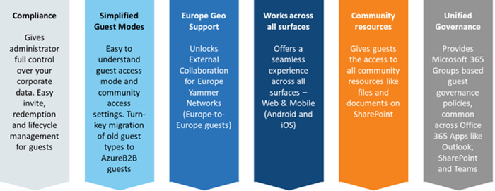

# Business-to-business (B2B) Guest support in Yammer Preview - Customer Terms and FAQ

## Guests turbo-charge collaboration in Yammer

External collaboration is a key ingredient for the success of any organization. Yammer guests allow you to call in experts, such as consultants or vendors, from outside your organization. Users can invite guests to a community and quickly start a rich conversation by sharing access community resources like files. This ease-of-use makes external collaboration one of the most used features in Yammer today.

**Now guests can use Microsoft Identity to collaborate across Yammer networks**

## New Yammer Guests – simplicity, governance, and compliance at your fingertips!

As the size of your organization increases, administrators need to strike a perfect balance. On one hand, you want to empower your employees to invite guests from outside the organization to foster seamless collaboration, but on the other hand, you need to put in place necessary guardrails so only authorized resources can be accessed by guest users. Many of you have requested additional guest governance and compliance capabilities in Yammer.

## We are excited to announce the new B2B Guests in Yammer!

Azure Active Directory B2B is a secure, compliant external collaboration framework used by many apps in the Microsoft 365 suite like SharePoint, Outlook, and Teams. It makes life easier for administrators by giving them the superpowers to manage guests easily. For the end users, it offers a seamless invite and collaboration flow that works across all Microsoft Apps.

## Why should I upgrade to the New Guest experience? 

Compliance is at the heart of the new guest support in Yammer. Admins can enable and disable guest access on a per community basis. They can control which users can invite guests into the tenant. They can easily configure email domains to allow and disallow guests. Even more – with the rich audit logs you can go back in time to review all guest actions in your tenant. This helps boost the productivity of your end-users because they do not have to bother or depend on the admins to manage guests.

**Key benefits of B2B Guests in Yammer**

**Example** At Contoso, the administrator has enabled guest access for Microsoft 365 Groups. Megan is the owner of the Contoso Partners community in Yammer, with Enrico and Alex as its members. She wants to invite external users Shawn and Jessica from Fabrikam to collaborate in this Yammer community in her organization. She simply adds their business emails in the member list. Shawn and Jessica receive an email invite. They accept the invite to start participating in the community right away. Guests can access all community content including files in SharePoint.

## What will happen to the legacy Guests in my network? 

**Simplified Guest access modes:** With new B2B guests, we are simplifying available guest types. This helps users in your organization add external guests who can collaborate seamlessly just like a regular member of the community. Some legacy guest types will no longer be supported and will be automatically mapped to the new guest mode – please see details below. 

|**#**|**Guest Mode**|**Impact**|
|:-----|:-----|:-----|
|1 |Thread level guest | To be discontinued; such guests will no longer be able to access threads they were added to earlier |
|2 |Group level guests  |To be mapped to B2B Group-level guests |
|3 |Network level guest  |To be discontinued; Network Level Guests will be mapped to B2B Group-level guests based on their current membership in communities at the time of migration |
|4 |External Networks  |To continue to work as-is. No change. |
|

## What’s new in the user and guest experience? 

The new B2B Guest support strengthens the coherence between Yammer and other Microsoft 365 apps. We have added some new capabilities in the guest flow for Admins, Community Owners, and Guests: 

- External guests can be added to any community based on the Owner/ Admin policy. 

- Simplified guest mode – Group level guests. 

- Unified and secure guest invitation and redemption flow. 

- Unlock External Collaboration (within Europe networks) for Europe Yammer networks 

- Common set of Microsoft 365 Groups based guest access policies. 

- Supports allow/deny list of domains, which lets admins control domains for incoming guests. 

- Admins can define which employees can invite guests. Example: An admin can set a rule to allow employees with “manager” title and above to only be able to invite guests.

- Guest access reviews allow admins to setup workflows and rules to periodically attest guest membership and block access for unauthorized guests immediately.

- B2B creates two separate guest identities of a guest - one in their home network and another in the inviting networks. Admins govern the data of incoming guests in their network.

- Rich audit logs track the guest lifecycle and the inviters for each guest. For more details, see [Auditing and reporting a B2B collaboration user](https://docs.microsoft.com/azure/active-directory/b2b/auditing-and-reporting).

## What features will not be available in the private preview?

- **Personal email/ Phone number-based legacy accounts** – The private preview will allow guests with Microsoft 365 Business email accounts. Other email domains like Gmail or Yahoo mail etc. will not be supported in this release. However, all legacy data (like old community posts, and files) of such users will be migrated so community members can see. Any legacy phone-based accounts will not be supported.

- **Cross-Geography guests** – Today we provide enable organizations to host Yammer in two data centers – Europe and North America. With this new guest support, users will be able to add guests from their same geography. (Please check our public  roadmap to see timelines for Cross-Geography support) 

- **Private Messages** – private messages are disabled for B2B guests in Yammer.

- **Live events** – Currently guest users will not be able to participate in live events  because guests are not yet supported by Microsoft Stream. To know more about when these features will be available please refer to the Microsoft Yammer roadmap. 

## Who is eligible to access the new experience?

The new B2B Guest support is currently available for Classic Yammer only i.e. users need to stay in Classic Yammer via the Opt-in toggle in the suite header. Support for B2B guests in the new Yammer interface is coming soon! Native Mode for Microsoft 365 for Yammer is a pre-requisite to enable the new B2B Guest private preview.

## How do I enable the preview within my organization?

Yammer global administrators can get access to the new B2B Guests in Yammer preview by submitting request through [this sign-up form](https://forms.office.com/Pages/ResponsePage.aspx?id=v4j5cvGGr0GRqy180BHbR2Fyyqbld7NOgsJqTjmkSf9UNkhaNDkyMzZKU0VFME00VzVBUkZHUFk2Qy4u). One you have signed-up, Microsoft engineering and support teams will reach out to you to finalize dates for enablement of early access for your tenant. 

## Are there any expectations around participating in the preview?

Thank you for choosing to help us shape the future of guest access in Yammer. As part of the customer preview, we ask for your help to get your feedback on the new guest experience. This comes in two parts: 

1. You, as the customer, accept that features will change during the preview and certain capabilities might not be at parity with the legacy Yammer guest experience. 

2. With the new B2B Guest experience, we request that you provide feedback about the experience via YammerExternFeedback@microsoft.com. This will help us improve the experience further in future releases.

## Yammer Preview Customer Support

> [!IMPORTANT]
> The new B2B Guest private preview is unsupported. The Service Level Agreement (SLA) for Microsoft Online Services does not apply to this preview.

During the private preview, you will need to raise any issues or bugs via the Yammer engineering teams or [Microsoft support](https://docs.microsoft.com/microsoft-365/admin/contact-support-for-business-products?view=o365-worldwide&tabs=online). 

When an issue occurs with only the private preview and it can be reproduced by Microsoft Support, then the issue will be logged for later investigation by the Yammer product group. The support case will be closed when adequate information has been captured. It may not be possible to resolve all issues reported during the private preview.

## Do SLAs apply to the new B2B Guests in Yammer preview? 

The Service Level Agreement for Microsoft Online Services does not apply to this preview. 

## What is a break-fix issue? 

Break-fix issues are technical problems you experience while using the new B2B Guest preview. *Break-fix* is an industry term that refers to *work involved in supporting a technology when it fails in the normal course of its function, which requires intervention by a support organization to be restored to working order.*

## How do I open a support case? 

Please see the [Support for business products - Admin Help page](https://docs.microsoft.com/microsoft-365/admin/contact-support-for-business-products?view=o365-worldwide&tabs=online) for general information. Your organization may have specific guidance for opening support cases, so you may need to talk with your IT team.

## How should I submit feature requests and feedback? 

Feature requests and feedback on the product during preview should be submitted through to the product teams at YammerExternFeedback@microsoft.com. Feedback can also be provided with peers through the new [Azure AD B2B Guests in Yammer page](https://techcommunity.microsoft.com/t5/yammer/new-azure-b2b-guests-in-yammer/m-p/1399715#M4094) in the Yammer Tech Community. 

Microsoft Support will not be accepting formal feature requests for the new B2B Guests preview submitted via the Design Change Request (DCR) process during the preview period.

## What severity of cases should be accepted during the preview? 

Please open non-critical (severity B or C) cases during the preview period for break/fix issues affecting the new B2B Guests preview. 

Critical (severity A) cases will not be accepted for new B2B Guests preview features. Any critical severity case impacting only the new B2B Guests preview will be downgraded by support after investigation.

## What steps should I take before reporting a technical problem? 

Before reporting a technical problem to Microsoft Support, please check the following: 

- **Can the issue be reproduced consistently?** If the issue is not occurring now, then it may have been resolved by a recent product update. 

- **Does the issue only occur for the new B2B Guests preview?** Or, does it also occur with the old user experience too? 

- **Can the issue be reproduced in multiple browsers?** Testing with at least two different web browsers is a best practice. 

- **Does the issue show up on mobile as well?** Sometimes issues occur with a backend service and can affect multiple clients (web, mobile, or desktop.) 

- **Are multiple users affected?** Issues affecting multiple users are more likely to be prioritized. 

- **Do you have clear screenshots?** Closely cropped screenshots can miss important information that is showing elsewhere on the screen. 

- **Is there any relevant information in the browser developer tools?** Support may ask you to check the JavaScript console for error information. While not everyone is familiar with JavaScript, you can often press F12 in your browser on Windows and look for red error messages in the console tab.

## FAQ

**Q: Is the new experience available for customers that have a Yammer network with EU data residency?**

A: Yes!

**Q: Will the upcoming changes impact Yammer External Networks?** 

A: These changes do not impact External Networks. External Networks will continue to work as-is. 

**Q: Is there a way to opt out of the preview?**  

A: The new B2B Guests in Yammer (and [Native Mode for Microsoft 365 for Yammer](https://docs.microsoft.com/yammer/configure-your-yammer-network/overview-native-mode) which is a pre-requisite for this preview) updates involve migration of users, communities, and data from legacy mode to Azure Active Directory and SharePoint respectively.

 From a compliance perspective, we encourage all tenants to migrate to the Native Mode for Microsoft 365 for Yammer. Hence, we do not offer a way to switch back to the legacy mode for Guests.

 **Q: Will Yammer guest settings be aligned to Microsoft 365 Groups settings?** 

Yes. With Native Mode for Microsoft 365 for Yammer, all communities and users are supported via Microsoft 365 Groups. The AAD guest settings for Microsoft 365 Groups will now also apply to Yammer communities. 

**Q: Can Yammer have dynamic membership groups to include guests from a domain?** 

Yes. Admins can create dynamic membership rules for guest users in a Yammer community via Azure portal. An example is: user.userType -eq "Guest" and user.email -contains "@xyz.com" - this rule will add all guest users from the domain xyz.com to the specified Yammer community. 

**Q: I don’t want to enable the new experience for my production Yammer network yet. How can I try the new B2B Guest experience in my test network?** 

A: You can try out the new B2B Guest experience on your existing test network. If you don’t have a test environment, you can create a [new trial tenant](https://signup.microsoft.com/) for testing and submit the tenant details in the sign-up form. 

## Related articles

[Yammer Blog](https://techcommunity.microsoft.com/t5/yammer-blog/bg-p/YammerBlog)

[Yammer admin Help](https://docs.microsoft.com/yammer/yammer-landing-page)

[Native Mode for Microsoft 365 for Yammer](https://docs.microsoft.com/yammer/configure-your-yammer-network/overview-native-mode)

[Yammer Help and Support Center for end-users](https://support.office.com/yammer)

