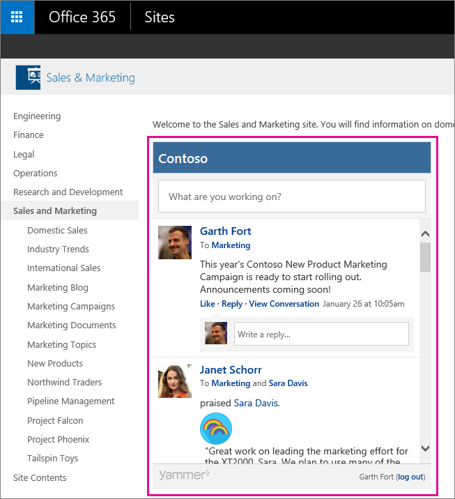

# Embed a Yammer feed into a SharePoint site

> [!NOTE]
> If you are using SharePoint Online, you can use the Yammer web part to embed Yammer conversations on a modern page. See [Use the Yammer web part](https://support.office.com/article/a53cfa0c-3d09-42c8-a286-1038a81c59da). 
  
For SharePoint Server (2013 or later), you can add a Yammer feed to a SharePoint with Yammer Embed. You can add several types of feeds to a SharePoint page, including:
  
- **Group feed** Show the latest conversations in a specific Yammer group. 
    
- **My Feed** Show each user their personal feed with items relevant to them. 
    - The Embed version of My feed shows slightly different messages than the ones included in the home feeds available in Yammer web, desktop, or mobile. In Embed My Feed, users will see messages from all threads in groups they are a member of and all threads in the All Company group. In Yammer web, desktop, and mobile, users can select **Discovery**, **All**, or **Following** feeds, but these aren't available in Embed. The Embed My Feed/Home feed type is closest to the All feed, but doesn't include public posts in public groups they don't belong to.
    
- **Open graph object feed** Start a discussion about an object, like a web page. 
    
You can also add these other types of feeds: topic feed or user feed. For more information, see [Yammer Embed](https://go.microsoft.com/fwlink/?LinkID=524147).
  
The following image shows Yammer Embed in action.
  

  
For Yammer Embed to work, your SharePoint environment must satisfy the following prerequisites:
  
- Your organization should have an active Yammer network (for example: www.yammer.com/contoso.com)
    
Yammer does not have to be the social collaboration tool for SharePoint for embedding to work, but if you want to make Yammer the primary social experience for SharePoint, see [Integrate Yammer with on-premises SharePoint 2013 environments](https://go.microsoft.com/fwlink/?LinkID=524180).
  
## Add a Yammer feed to a SharePoint Online or SharePoint Server page
<a name="AddFeed"> </a>

To add a feed using Yammer Embed, you:
  
1. Copy and edit a simple script that identifies the type of feed you want and the Yammer network you are using.
    
2. Add a script editor web part to your SharePoint page and paste the script into the web part.
    
The following procedures describe how to add a [group feed](embed-a-feed-into-a-sharepoint-site.md#GroupFeed), [my feed](embed-a-feed-into-a-sharepoint-site.md#MyFeed), or a [page feed](embed-a-feed-into-a-sharepoint-site.md#Pagefeed) to a SharePoint Online or SharePoint Server page using Yammer Embed and a script editor web part. The screenshots show the SharePoint Online user interface. For information about other feed types, see [Yammer Embed](https://go.microsoft.com/fwlink/?LinkID=524147). You can also use the Yammer Embed configuration tool to create the script to use. See [Add the Yammer Embed widget to a SharePoint page](https://go.microsoft.com/fwlink/?LinkID=525587) for how to use the configuration tool. 
  
 **Add a group feed**
  
1. In Yammer, go to the group that you want to embed. Locate the **Access Options** section and select **Embed this group in your site**.
    
    
  
2. Copy the script from the window.
    
3. In your SharePoint site, choose **Edit**.
    
4. On the ribbon, choose **Insert** \> **Web Part** and in the **Categories** list, select **Media and Content** \> **Script Editor**.
    
    In **Add part to:**, select where you want to add the web part, and then choose **Add**.
    
5. Locate your new script editor web part, and choose **Edit Snippet**.
    
6. Paste the script you copied from Yammer into the script editor web part.
    
    
  
7. Choose **Insert**.
    
8. Save and publish the SharePoint page. You should see the Yammer Group conversation on the SharePoint page, similar to the following illustration.
    
    
  
 **Add my feed**
  
1. In your SharePoint site, choose **Edit**.
    
2. On the ribbon, choose **Insert** \> **Web Part** and in the **Categories** list, select **Media and Content** \> **Script Editor**.
    
    In **Add part to:**,select where you want to add the web part, and then choose **Add**.
    
3. Locate your new script editor web part, and choose **Edit Snippet**.
    
4. Edit the following script to use your Yammer network instead of contoso.com, and then paste it into the script editor web part.
    
  ```
  <div id="embedded-my-feed" style="height:400px;width:500px;"></div> 
      <script type="text/javascript" src="https://c64.assets-yammer.com/assets/platform_embed.js"></script>
      <script 'type="text/javascript"> yam.connect.embedFeed({  
                container: '#embedded-my-feed',
                network: 'contoso.com'  });
      </script>
  
  ```

    > [!NOTE]
    > You can also change the height and width parameters to the height and width you prefer. 
  
5. Choose **Insert**.
    
6. Save and publish the SharePoint page. You should see your Yammer feed on the SharePoint page, similar to the following illustration.
    
    
  
 **Add a page feed**
  
1. In Yammer, go to the page that you want to embed. Copy the URL to the page.
    
2. In your SharePoint site, choose **Edit**.
    
3. On the ribbon, choose **Insert** \> **Web Part**, and in the **Categories** list, select **Media and Content** \> **Script Editor**.
    
    In **Add part to:**, select where you want to add the web part, and then choose **Add**.
    
4. Locate your new script editor web part, and choose **Edit Snippet**.
    
5. Edit the following script to use your Yammer network instead of contoso.com and to use the URL to the page that you want to discuss, and then paste it into the script editor web part.
    
  ```
  <div id="embedded-feed" style="height:400px;width:500px;"></div> 
  <script type="text/javascript" src="https://assets.yammer.com/assets/platform_embed.js"></script> 
  <script type="text/javascript"> yam.connect.embedFeed({
           container: "#embedded-feed", 
           network: "contoso.com", 
           feedType: "open-graph", 
           objectProperties: { url: "http://www.contoso.com/sample_page" , type: "page" } }); 
  </script>
  
  ```

    This example shows a feed for a web page, but you can create feeds for other open-graph objects. The list of valid object types is at [Schema \> Supported Object Types](https://go.microsoft.com/fwlink/?LinkId=525586). If you are interested in using the Yammer Embed widget to add Yammer feeds to your SharePoint pages, see [Add the Yammer Embed widget to a SharePoint page](https://go.microsoft.com/fwlink/?LinkId=525587).
    
    > [!NOTE]
    > You can also change the height and width parameters to the height and width you prefer. 
  
6. Choose **Insert**.
    
7. Save and publish the SharePoint page. You should see a Yammer conversation thread, ready for you to start a discussion, similar to the following illustration.
    
    
  
## See also

[Yammer - Admin Help](https://support.office.com/article/e1464355-1f97-49ac-b2aa-dd320b179dbe)

