# Create a knowledge-based community in Yammer by using QnA Maker and Flow

This article provides steps to set up a Yammer group to provide automated answers to questions posted in the group. This solution integrates Yammer with Azure QnA Maker and Microsoft Flow, and uses SharePoint Online and Outlook features available to all Yammer Office 365 connected groups.  

- QnA Maker, a service that builds a question and answer service from your semi-structured content, is used to find relevant answers for user's natural language questions. 

- Flow provides the necessary workflow between QnA maker, the Yammer group, SharePoint Online, and Outlook to handle questions that don't already have answers defined and store new questions and answers. 

Once you have this integration set up with a small list of questions and answers, users will be able to post questions in the group and receive automatic answers. If a user asks a question that doesn't have a clear match, the proposed answer is forwarded to a specific person to verify. Each verified answer is included as a response to the question, and also expands the knowledge base so it can be used for future questions.

After you get the integration working with the sample content provided, you can replace the sample content with relevant questions and answers for your organization.

For more ideas about how to use this integration to help with any situation where many people have similar questions such as new employee onboarding, self-help for IT problems, event planning, or communicating about organizational changes, see [Crowdsourcing to Create a Knowledge Base in Yammer](https://techcommunity.microsoft.com/t5/Yammer-Blog/Crowdsourcing-to-Create-a-Knowledge-Base-in-Yammer/ba-p/314869).

## Prerequisites

- An Azure subscription and an account with permissions to create resource groups and resources.

- An Office 365 license: Business Essentials/Premium or Enterprise E1/E3/E5.

- Office 365 connected groups enabled for your Yammer network.

- A Yammer Office 365 connected group to use for the automated knowledge base. Because this group will be connected to QnA Maker, it should be a group dedicated to the knowledge base.

## Step 1: Download files needed for this integration

This article has two associated flow packages and an Excel spreadsheet containing sample questions and answers.

1. [Download the files from the Yammer technical community](https://go.microsoft.com/fwlink/?linkid=2054570).

2. Double-click the Knowledge-based-community-files.ZIP file to unzip the files. You'll see the following files:

|**File**|**Description**|
|:-------|:--------------|
|SampleFAQs.xlsx|Sample questions to seed the automated knowledge base.|
|YammerFAQs.zip|Zip file containing a package for the flow that connects Yammer to QnAMaker.|
|AddItemToQNAMaker.zip|Zip file containing a package for the flow that connects the group's SharePoint list to QnAMaker.|

## Step 2: Use QnA Maker to create a knowledge base

In this step, you'll use the Microsoft Azure QnA Maker web service to create an instance of QnA Maker for your organization. If you want to read about QnA Maker before you get started, see [What is QnA Maker?](https://docs.microsoft.com/en-us/azure/cognitive-services/QnAMaker/overview/overview). 

1. Open https://www.qnamaker.ai/Create, and sign in with your Azure account. 

     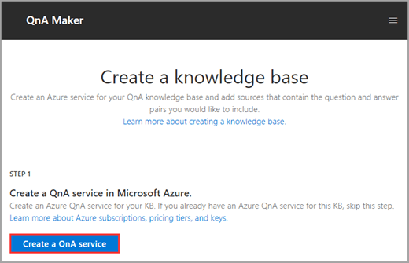
 
2. Click **Create a QnA service**. This opens a new browser window to the Azure portal.
    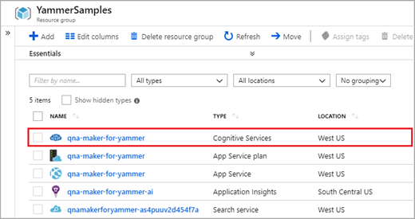
 
   a. Enter a **Name**. For example: **qna-maker-yammer**.

   b. Choose a **Management pricing tier**. **F0** is enough for this sample.

   c. Choose a **Search pricing tier**. **F** is enough for this sample.

   d. If **Name** does not pass validation, update it.

   e. Select values for the other fields and then click **Create**.

   f. After the deployment finishes, go to the Resource group.

     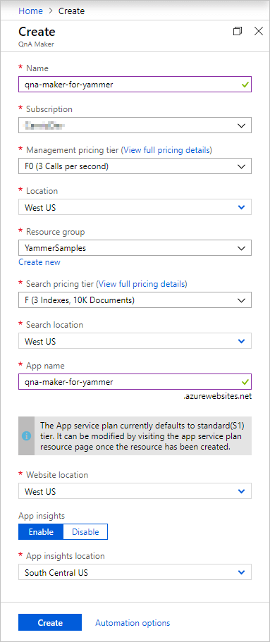
 
   g. Open the **Cognitive Services** resource, and then click **Keys**.
   
     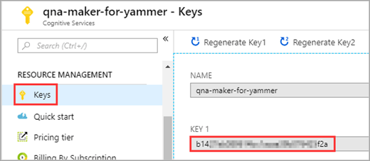
 
   h. Copy  the value for **KEY 1**. This value will be used to initialize the **Cognitive Services Key** variable in the Yammer FAQs flow that will be imported and updated later.

3. Go back to the knowledge base create page that you opened.

   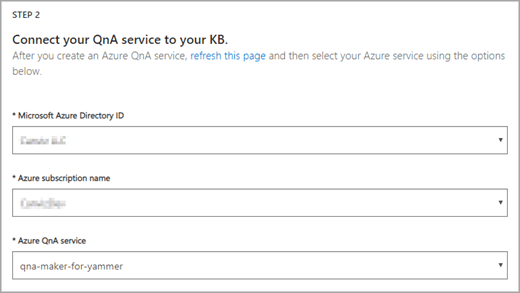
 
    a. Click **refresh this page**, and then choose the QnA service from your Azure directories and subscriptions.

4. In the **Name** field, enter a name for the kb. For example: **Sample QnA FAQ**
  
     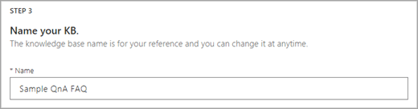
 
5. Populate the kb with a base source by clicking **+ Add file** and uploading the SampleFAQs.xlsx file that you downloaded in Step 1.

    > [!NOTE]
    > You must customize the SampleFAQs to language in which you want your KB. 

   
 
6. Click **Create your kb**.

   
 
7. Click **Save and train**.

   
 
8. Click **PUBLISH**.

   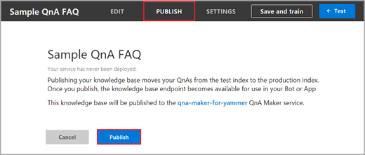
 
    a. Click **Publish**.
 
    b. From the **Success** page, copy the three strings indicated in red rectangles below. You'll use these to initialize variables in the Yammer FAQs flow.

   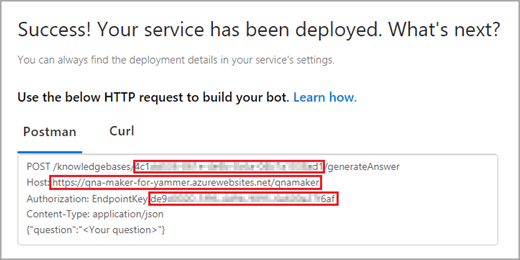

    - Use the top one for the **Knowledge Base Id** variable.

    - Use the middle one for the **Knowledge Base Service Host** variable.

    - Use the bottom one for the **Knowledge Base Endpoint Key** variable and **QnA Maker connection**.

## Step 3: Create a list of intitial questions and answers in the Yammer group's SharePoint site

In this step you'll create the structure for the list of questions and answers, and populate it with some sample questions and answers. Once you get the integration working with the sample, you can replace the content of the list with questions and answers that apply to your own content.

1. Open an Office 365 connected group in Yammer and click **SharePoint Site**.

   

2. Copy the site URL. You'll use this to configure the **Create item** node of the Yammer FAQs flow.

   

    a. Create a new list named **QnA**. Click **+ New**, and then click **List**.

   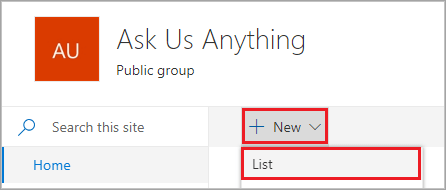
 
    b. In the **Name** textbox, enter **QnA**, and then click **Create**.
 
   
 
3. To rename the **Title** column to **Question**, click **Title**, click **Column settings**, and then click **Rename**.

   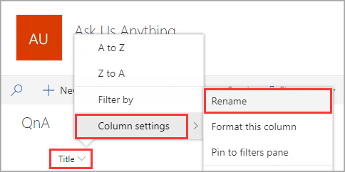
  
    a. In the **Name** textbox, enter **Question**, and then click **Save**.
 
   
 
4. To create a new column named **Answer**, click **+ Add column**, and then click **Multiple lines of text**.
 
   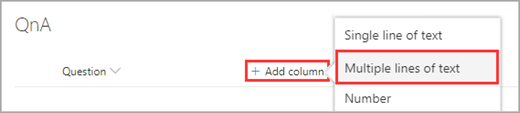
 
    a. In the **Name** textbox, enter **Answer**, and then click **Save**.
 
   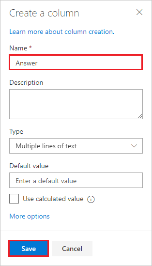
 
5. In your new list, upload a few questions and answers. There is a sample set of questions and answers in the SampleFAQs.xlsx file in the download that you can use as you experiment with your integration.

## Step 4: Update the flow that connects your Yammer group with QnA Maker

1. Open https://flow.microsoft.com, and sign in with your work account.
 
   
 
2. Upload the **YammerFAQs.zip** flow package that you downloaded in Step 1.

    a. Click **My flows**.
 
   
 
    b. Click **Import**.
 
   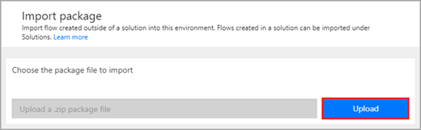
 
    c. Click **Upload**, then select the **YammerFAQs.zip** file you downloaded.

   
 
3. After the package has been uploaded, modify the **IMPORT SETUP** configuration for the **Related resources**.
 
   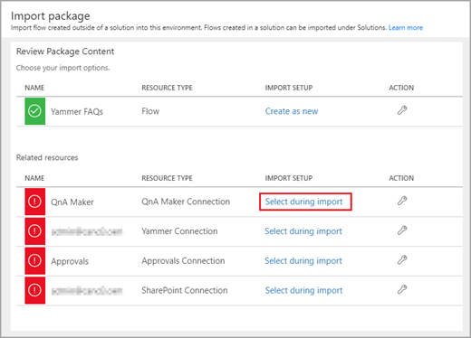
 
    a. In the QnA Maker resource, click **Select during import**.
 
   
 
    b. Click **+ Create new**.
 
   
 
    c. Click **+ New connection**, then search for **QnA Maker**.
 
   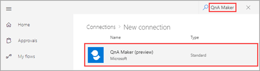
 
    d. Click the **QnA Maker** provided by Microsoft.
 
   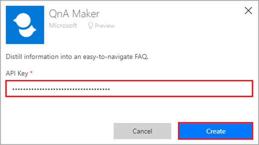
 
    e. Paste the **Knowledge Base Endpoint Key** into the **API Key** box, then click **Create**.

    f. Go back to the **Import setup panel** and click **Refresh list**.
 
   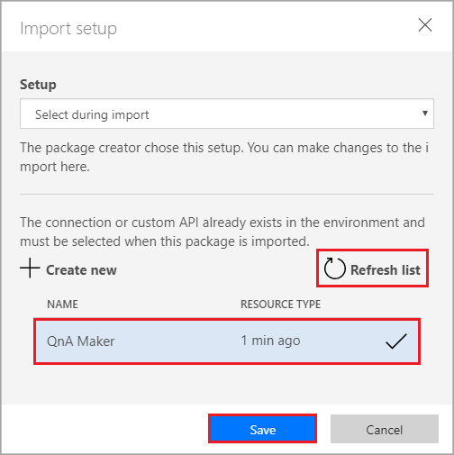
 
    g. The **QnA Maker** connection you just created will appear. Select it, then click **Save**.

4. Use the steps under step 4 above as a guide to configure the rest of the connections (shown in the red rectangles in the picture below). Refer to the screenshots below for all the connections to help you search for and locate the appropriate connections.
 
   
 
    - **Yammer Connection**
 
       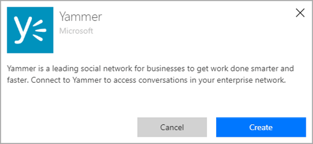
 
    - **Approvals Connection**
 
       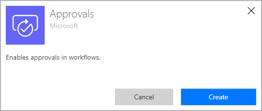
 
    - **SharePoint Connection**
 
       
 
5. At the bottom of the page, click **Import**.
 
   
 
    a. After the flow has successfully imported, click **Open flow**.
 
   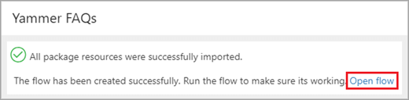
 
6. Update the flow.
 
   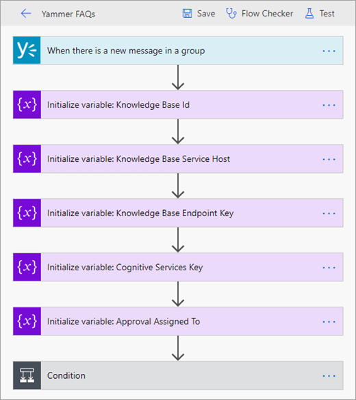
 
    a. Click the first node, and choose the Yammer group you created or used earlier.

   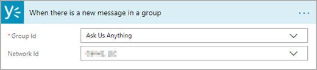
 
    b. Use the values you collected earlier to initialize the variables:

      - **Knowledge Base** 

         - Id

         - Service Host

         - Endpoint Key

      - **Cognitive Services Key**

    c. To initialize a variable's value, click an Initialize variable node, and then paste the value into the **Value** box.

   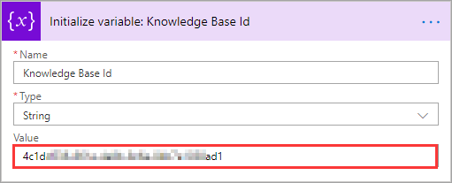
 
    d. Initialize **Approval Assigned To**, and fill the value with your Office 365 work email. 

    This sets you up as the official approver of suggested answers from the QnA Maker for your knowledge base. This is useful while you're building and testing your integration, and you can change it later to the person who will be responsible for verifying proposed answers.
 
   
 
    e. Find the **Create item** node and paste in the SharePoint Site URL. To find **Create item**: 

      1. Click **Check if the message is a question**.
   
      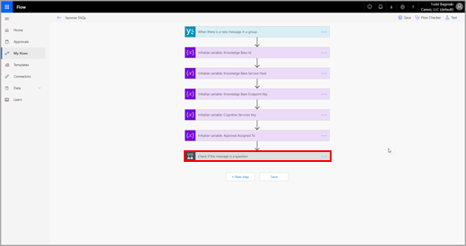

      2. Under the **If yes** condition, click **Apply to each answer**.   
      
      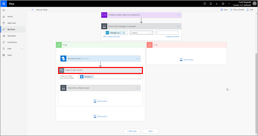

      3. Click **Check the confidence level**.   
     
      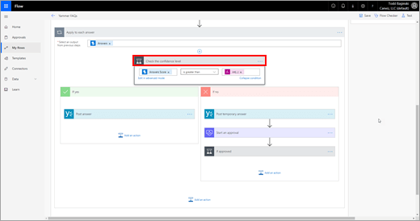

      4. In the **If no** section, click **If Approved**.   
     
      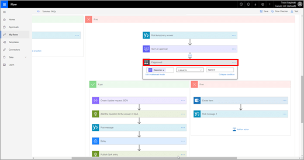

      5. In the **If no** section, click **Create item**.   
      
      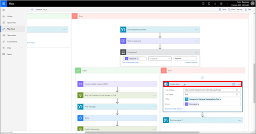

      6. Paste the SharePoint Site URL in the **Site Address** text box.   
      
      
 
    f. Click **Save**.

   

## Step 5: Import and update the flow that adds items from Yammer to QNA Maker

1. To import **AddItemToQnAMakerFlow.zip** flow package that you downloaded in Step 1, use the same process you used to import the previous flow.
 
   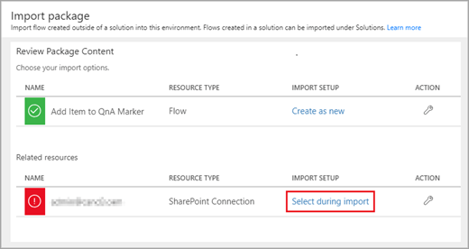
 
> [!NOTE]
> Instead of creating a new SharePoint Connection, you can select the one you created earlier. 

2. Update the flow.

    a. Click the first node, and paste the SharePoint Site URL into the **Site Address** text box.

       
 
    b. Use the values you collected earlier to initialize **Knowledge Base Id** and **Cognitive Services Key**.
 
       
 
3. To save the flow, click **Save**.

## Step 6: Try it! Ask sample questions in the Yammer group

Now that you have everything set up, you can ask some suggested sample questions in your Yammer group, and see how they are turned into official answers, using the sample content you put in SharePoint. You'll see what happens when QnA Maker identifies an answer, and when it isn't sure it has an answer.

1. Ask the following sample question in your Yammer group: 
**Who is the target audience for the QnA Maker tool?**
 
   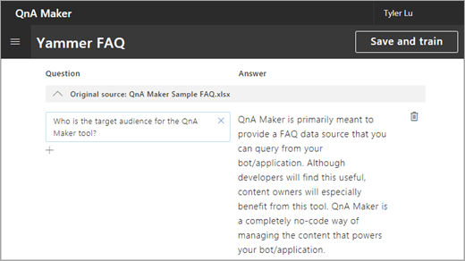
 
Wait up to two minutes for an answer.
 
   
 
2. Ask a question to the Yammer Group that is slightly different then what the knowledge base is expecting, such as:
**Please let me know is the QnA Maker cost-free?**
 
   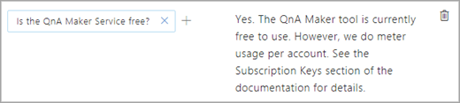
 
    a. The Cognitive Services will identify that this question is similar to one that it has an answer for, but it is not quite confident enough that it is correct, so it will trigger an email for approver verification.
 
   
 
    b. The approver will then review the answer that the Cognitive Service wants to provide and then Approve it Outlook.
 
   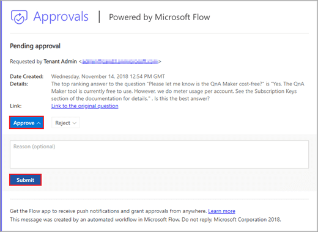
 
    c. A new answer will then be provided in the Yammer conversation
 
   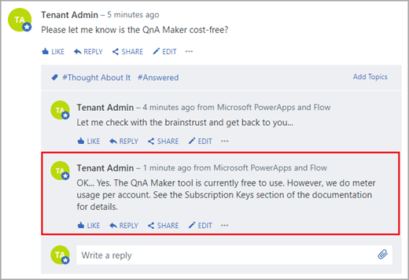
 
    d. The question asked will be added to the knowledge base by the flow so that the question can be answered quicker in the future.
 
   
 
    > [!NOTE]
    > If you ask the same question again, you will get the answer immediately. 

3. Ask a question that is not in the knowledge base: 
**Can we create a live event in a Yammer group?**
 
   
 
   a. Just like before, Cognitive Services will look for approval. In Outlook, reject the wrong answer, and input the correct answer in the comments box, then click **Submit**.
 
   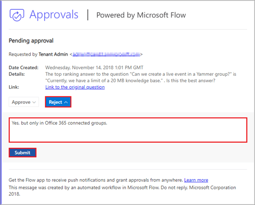
 
    b. A new answer will be provided in the Yammer conversation.
 
   
 
    c. The question asked will be added to the QnA list by the Yammer FAQs flow.
 
   
 
    d. Finally, the newly added SharePoint list item will be added to the knowledge base by the Add Item to QnA Marker flow.
 
   
 
    > [!NOTE]
    > If you ask the same question again, you will get the answer immediately. 

## Step 7: Replace the sample content with your own

Now that you have the integration working with sample content, replace the sample content with appropriate content for your organization.

Thank you to Todd Baginski, Microsoft MVP, for developing this integration.
