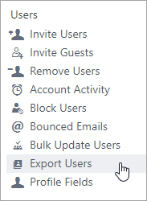
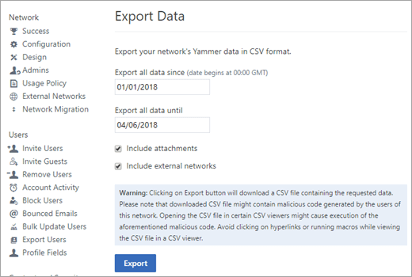

# Export data from Yammer Enterprise

As a verified admin, you can export Yammer Enterprise data to monitor usage and content and for discovery and compliance purposes. The following table lists the four ways to export data.
  
|||
|:-----|:-----|
|**Method**   |**Purpose**   |
|[Export user and admin list](export-yammer-enterprise-data.md#ExportUsers)   |Identify status of current admins and users, and review email, title, location, and department of each user.    |
|[Export Yammer network data by date range and network](export-yammer-enterprise-data.md#ExportNetworkData)   |View and audit all network data for all users. You can specify a date range, and choose whether to include files and external network data.    |
|[Export data for one user](export-yammer-enterprise-data.md#ExportOneUser)   |Identify all data related to one user. You can use this export to identify data that needs to be deleted to comply with a GDPR data subject request.    |
|[Set up automatic data exports](export-yammer-enterprise-data.md#Automatic)   |Automate exports that need to be done on an ongoing basis for compliance by using the DataExport API .    |
   
> [!NOTE]
> Exported data can't be used for migrating content between Yammer networks. For migration information, see [Network migration: Consolidate multiple Yammer networks](../configure-your-yammer-network/consolidate-multiple-yammer-networks.md). 
  

## Export user and admin list

1. In Yammer, click the Yammer settings icon , and then click **Network Admin**.
    
2. Click **Export Users**.
    
    
  
3. On the Export Users page, choose **Export all users**, and then click **Export**.
    
    
  
4. Save the exported file. The file is saved as a compressed file with a .zip file name extension.
    
5. Go to the location where you saved the compressed file and expand it.
    
    The export contains the following files:
    
|||
|:-----|:-----|
|**File**   |**Contents**   |
|**log.txt**   |Summary of the export.    |
|**request.txt**   |The parameters of the export.    |
|**Admins.csv**   |A list of current admins, their email addresses, and whether they are a verified admin or a network admin.    For more information on the types of admins in Yammer, see [Manage Yammer admins](../manage-yammer-users/manage-yammer-admins.md).    |
|**Networks.csv**   |Information about your home network and any external networks, including the name, URL, creation date, whether it is moderated, whether it has a usage policy, and the number of users.    |
|**Users.csv**   | The ID, name, email, job title, location, department, user ID, deletion status (deletion date, name and id of person who deleted the user), join date, suspension status (deactivated date, name and ID of person who deactivated the user), and the state of the user (active or soft-deleted).     A user is who is in the soft_delete state means the user is either:  - pending, if there are no joined_at, suspended_at, or deleted_at values)   - suspended (deactivated), if there is a suspended_at value, but no deleted_at value  - deleted, if there is a deleted_at value    Guest users can be identified in the user export by reviewing the email address field. If the email address doesn't match the domain of the home network, the user is aguest.  The api_url is the URL used to obtain user metadata. For more information about using the data in this field, see the [Yammer developer documentation](https://go.microsoft.com/fwlink/?linkid=874691).    |
   

## Export Yammer network data by date range and network

1. In the Yammer admin center, go to **Content and Security** \> **Export Network Data**.
    
2. Specify the data to include:
    
    
  
      - **Date range:** Only data in the specified date range will be included. 
    
      - **Include attachments**: If not selected, you'll get a list of files. If selected, you also get a **Files** folder with all files in their native format. 
    
      - **Include external networks**: If not selected, you'll only get data from your home network. If selected, you'll get a separate folder for the data from each network. Each network is identified by its ID, and the full network names are listed in **Networks.csv**. 
    
    
  
3. Click **Export**.
    
    Data is exported into a .zip file. If there is more than one network exported, a separate folder is created for each network. 
    
|||
|:-----|:-----|
|**File**   |**Contents**   |
|**log.txt**   |Summary of the export.    |
|**request.txt**   |The parameters of the export.    |
|**Admins.csv**   | Lists the name, email, and type of all Yammer admins for each selected network.    |
|**Files.csv**   |For any file added or modified during this date range from Yammer, lists the Yammer ID, type of file, name, description, and path to the file, along with metadata including the group it was posted in. The storage_path column shows whether the file is stored in Yammer or SharePoint.    Files.csv does not contain the actual files.  Files that are stored in Yammer are exported in their native format to the **Files** folder of the zip file. Files that are stored in SharePoint are not exported.   The file_ID and path columns in Files.csv can be used to identify the files in the **Files** folder or to go directly to the file in Yammer. For information about how to go directly to a specific file, see [Delete specific messages or files](export-yammer-enterprise-data.md#DeleteMessagesFiles).     For files that are stored in SharePoint, use the download_url column to download the file. Or, you can use [Content Search in Office 365](https://docs.microsoft.com/office365/securitycompliance/content-search) to find files stored in SharePoint during the specified date range.   To delete a file, whether it is saved in Yammer or SharePoint, always delete it from  Yammer. This erases the metadata in Yammer as well as the metadata and file in SharePoint. If you delete the file from SharePoint directly, the Yammer metadata still remains.    |
|**Groups.csv**   | For any group created or modified during the specified date range, lists the Yammer ID, name, description, privacy status, whether the group is internal or external, link to the group, who created the group, creation date, and updated date.    |
|**Messages.csv**   |For any message sent or modified during the specified date range, lists the message ID, thread ID, group ID, group name, privacy status, sender ID, name and email, the full body of the message, attachments, and creation and deletion information.  For information about how to go directly to a specific message in Yammer, see [Find and delete specific messages or files](export-yammer-enterprise-data.md#DeleteMessagesFiles).    |
|**MessageThreadsOutbound.csv**   |Includes IDs of external participants in outbound messages.    |
|**MessageVersions.csv**   | Includes IDs and modification information for messages that have been edited.    |
|**Networks.csv**   |Lists your home network and all external networks included in the export.    |
|**Pages.csv**   | For any page created or modified during the specified date range, lists the IDs, dates, and owners of the page.    |
|**Topics.csv**   | For any topic created during the specified date range, lists the creation information and a link to the topic.    |
|**Users.csv**   | For any user who joined, or was deleted or suspended during the specified date range, lists email, job-title, location, department, a link to the user, and information about the users current state.  A user is who is in the soft_delete state means the user is either    - pending, if there are no joined_at, suspended_at, or deleted_at values)  - suspended (deactivated), if there is a suspended_at value, but no deleted_at value   - deleted, if there is a deleted_at value  Guest users can be identified in the user export by reviewing the email address field. If the email address doesn't match the domain of the home network, the user is aguest.  The api_url is the URL used to obtain user metadata. For more information about using the data in this field, see the [Yammer developer documentation](https://go.microsoft.com/fwlink/?linkid=874691).    |
|**Files folder:**   | This folder contains files that are stored in Yammer and have been created or modified during the specified time period. It does not contain Yammer files stored in SharePoint.  Files are in their native format and are named with their Yammer ID. For example, a PowerPoint presentation might be listed as 127815379.pptx.    |
   
The following types of data are not included in this export:
  
- Data available in the user's settings, including their profile, the networks they are members of, their account activity, applications, notifications, and language preferences, and their org chart.
    
- User's activity data.
    
- Bookmarked messages, group membership, followed or following users, or followed topics. To find this information for a user, click the user's name. 
    
To find this data for an individual user, click the Yammer settings icon , click **People**, and click the name of the user whose data you want to view. This page shows the user's profile, conversations they've participated in, any files, images, and videos they have posted, along with their bookmarks, followed and following users, and followed topics.
 

## Export data for one user

> [!NOTE]
> You must export user data for each network the user is a member of. 
  
1. In the Yammer admin center, go to **Content and Security** \> **Export User Data**.
    
2. Type the user's name and select the user.
    
3. Click **Export**.
    
    Data is exported into a .zip file containing the following files.
    
|||
|:-----|:-----|
|**File**   |**Contents**   |
|**log.txt**   |Summarizes the number of entries in each .csv file, and lists any errors that occur during the export.    |
|**request.txt**   |Parameters use for the export.    |
|**Broadcast.csv**  |For any live event video posted by the user, includes the network ID, group ID and name, title, description, links to the video, and additional information about the video.  The video content is not included in the export. The video is saved in Microsoft Stream. To edit metadata or delete the video, you can open the video in Microsoft Stream admin mode. For more information see [Admin capabilities in Microsoft Stream](https://docs.microsoft.com/en-us/stream/manage-content-permissions) and [Office 365 Data Subject Requests for the GDPR, Stream](https://docs.microsoft.com/en-us/microsoft-365/compliance/gdpr-dsr-office365#stream) |
|**Files.csv**   | For any file added or modified by this user from Yammer, lists the Yammer ID, type of file, name, description, and path to the file, along with metadata including the group it was posted in. The storage_path column shows whether the file is stored in Yammer or SharePoint.    Files.csv does not contain the actual files.  Files that are stored in Yammer are exported in their native format to the **Files** folder of the zip file. Files that are stored in SharePoint are not exported.   The file_ID and path columns in Files.csv can be used to identify the files in the **Files** folder or to go directly to the file in Yammer. For information about how to go directly to a specific file, see [Delete specific messages or files](export-yammer-enterprise-data.md#DeleteMessagesFiles).     For files that are stored in SharePoint, use the download_url column to download the file. The download_url could be used for SharePoint files only if an AAD token is provided. Or, you can use [Content Search in Office 365](https://docs.microsoft.com/office365/securitycompliance/content-search) to find files stored in SharePoint and created or modified by a specific user.   To delete a file, whether it is saved in Yammer or SharePoint, always delete it from  Yammer. This erases the metadata in Yammer as well as the metadata and file in SharePoint. If you delete the file from SharePoint directly, the Yammer metadata still remains.  |
|**Groups.csv**   | For any group created or modified by the user, lists the Yammer group ID, name, description, privacy status, whether the group is internal or external, link to the group, creation date, and updated date. This file also includes the aggregated total number of polls the user voted on, and the polls the user created.    |
|**LikedMessages.csv**   | For any message liked by the user, lists the message ID, thread ID, group ID, group name, privacy status, sender ID, name and email, the full body of the message, the ids for attachments, and creation and deletion information. A list of polls you created will also be provided. For announcements, includes the title of the announcement.   |
|**Messages.csv**   | For any message sent or modified by the user, lists the message ID, thread ID, group ID, group name, privacy status, sender ID, name and email, the full body of the message, the ids for attachments, and creation and deletion information. A list of polls you created will also be provided. For announcements, includes the title of the announcement.   |
|**BestReplyMessages.csv**   | For any message marked as best reply by the user, lists the message ID, thread ID, group ID, group name, privacy status, sender ID, name and email, the full body of the message, the IDs for attachments, creation and deletion information.  |
|**Topics.csv**   |For any topic created by the user during the specified date range, lists the creation information and a link to the topic.    |
|**Files folder**.    | This folder contains files that are stored in Yammer and have been created or modified by the user during the specified time period. It does not contain Yammer files that are stored in SharePoint.  Files are in their native format and are named with their Yammer ID. For example, a PowerPoint presentation might be listed as 127815379.pptx.   |
   
4. When the user's account activity data is ready, you'll receive a Yammer inbox message with a link to the data. Click the link to open it.
    
Exported data does not contain bookmarked messages, group membership, followed or following users, followed topics, the user's notification, application, and language settings, and org chart. To find this data for an individual user, click the Yammer settings icon , click **People**, and click the name of the user whose data you want to view. This page shows the user's profile, conversations they've participated in, any files, images, and videos they have posted, along with their bookmarks, followed and following users, and followed topics.
  
## Troubleshoot data export

- If the .zip file is corrupted and can't be unzipped, try again. If this doesn't work, [contact Support](https://support.office.com/en-us/article/Contact-support-for-business-products-Admin-Help-32a17ca7-6fa0-4870-8a8d-e25ba4ccfd4b).

- If the log.txt file shows export errors for one category of data, try again. If there are still errors, [contact Support](https://support.office.com/en-us/article/Contact-support-for-business-products-Admin-Help-32a17ca7-6fa0-4870-8a8d-e25ba4ccfd4b).
 

## Find and delete specific messages or files

Use the Yammer file ID from the export to go directly to the file in Yammer and delete it. 

> [!IMPORTANT]
> For Yammer files stored in SharePoint, delete the files from Yammer in order to remove the Yammer metadata as well as the file.
  
To find and delete a specific message: 
1. Build the URL for the message. Use **https&#58;//www&#46;yammer&#46;com**/*network_name*/**#**/**Threads**/**show?threadId=** *thread_id*. For example, https&#58;//www&#46;yammer&#46;com/contosomkt&#46;onmicrosoft&#46;com/#/Threads/show?threadId=1040647232.

2. In the message, click the **More** icon , and then click **Delete**.
    
To find and delete a specific file:

- Use the **Search** box in Yammer. For example, for a file named 12345678.pptx in the export, search for 1235678.pptx. In the search results, click **Go to File** file, and then click **Delete this File**.

- Or, build the URL for the file. Use **https&#58;//www&#46;yammer&#46;com**/*network_name*/**#**/**files**/*file_number*, for example https&#58;//www&#46;yammer&#46;com/contosomkt&#46;onmicrosoft&#46;com/#/files/12345678. On the Yammer page for the file, click **Delete this File**.
    

## Set up automatic data exports

To set up automatic recurring exports, use the Yammer API. For information about the Data Export API, go to [/export](https://go.microsoft.com/fwlink/?LinkID=534735) on the Yammer Developer Center. 
  
## Related articles

[View Group Insights in Yammer](https://support.office.com/article/73f9fa6d-d442-4f25-9194-d5317c9328ab.aspx)
  
[Office 365 Reports in the Admin Center - Yammer activity report](https://support.office.com/article/c7c9f938-5b8e-4d52-b1a2-c7c32cb2312a)
  
[Export Yammer group members and email addresses to a .csv file](https://support.office.com/en-us/article/export-yammer-group-members-to-a-csv-file-201a78fd-67b8-42c3-9247-79e79f92b535)

[Audit Yammer user data](../manage-yammer-users/audit-users-connected-to-office-365.md)
  
[Manage GDPR data subject requests in Yammer Enterprise](gdpr-requests-in-yammer-enterprise.md)
  
[Manage Yammer data compliance](manage-data-compliance.md)

