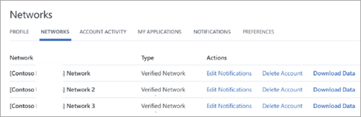

# Manage GDPR data subject requests in Yammer Basic

In Yammer Basic, each user controls their own account and content. There is no centralized administration. This article describes how to use Yammer administrative tools to honor data subject requests for GDPR. It includes how to find, access, edit, delete, and export personal data that resides in Microsoft's cloud.
  
> [!IMPORTANT]
> Remove any data you want removed before you delete your account. After you delete your account, you no longer have access to the data to remove it. 
  
You can edit your own profile, change your notifications, delete your own account, download your own data, and monitor your own activities and preferences. You can also remove invited guests from a conversation and remove invited users from a group. 
  
## Edit your profile and settings

1. Click the Yammer settings icon , and then click **Edit Settings**.
    
      - To change your profile, select **Profile**.
    
      - To change your password, select **Password**.
    
      - To edit your notifications, select **Networks**. 
    
        
  
      - To see your account activity, select **Account Activity**.
    
      - To see what applications you've installed, select **My Applications**.
    
      - To set preferences, select **Preferences**.
    
## Export your data

You can export your own data in Yammer Basic, and can choose to delete any data you posted. 
  
 It isn't possible to export data for all users. 
  
1. Click the Yammer settings icon , and then click **Edit Settings**.
    
2. Click **Networks**. 
    
3. For each network you belong to, select **Download Data**. 

    

    Data is exported into a .zip file. If you're a member of more than one network, a separate folder is created for each network. 

    - **.txt files**
    
    - **request.txt** Contains the parameters for the export. 
    
    - **log.txt** Summarizes the number of entries in each .csv file. 
    
    - **.CSV files:** There is one .csv file for each type of data: 
    
    - **Files.csv** For any file you added or modified during the specified date range, lists the Yammer ID, type of file, name, description, and path to the file in Yammer, along with metadata including the group it was posted in. 
    
        This data can be used to link directly to a Yammer file. Files.csv does not contain the actual file. If you selected to include attachments in your export, files can be found in the **Files** folder of the .zip file. Use the ID from Files.csv to identify a specific file in the Files folder. 
    
    - **Groups.csv** For any group you created or modified during the specified date range, lists the Yammer ID, name, description, privacy status, whether the group is internal or external, link to the group, creation date, and updated date. This file also includes an aggregated total of the number of polls you voted, and what polls you created. 
    
    - **LikedMessages.csv** For any message liked by the user, lists the message ID, thread ID, group ID, group name, privacy status, sender ID, name and email, the full body of the message, the IDs for attachments, and creation and deletion information. A list of polls you created will also be provided. For announcements, includes the title of the announcement.     

    - **Messages.csv** For any message you sent or modified during the specified date range, lists the message ID, thread ID, group ID, group name, privacy status, sender ID, name and email, the full body of the message, the full text of the message, attachments, and creation and deletion information. For announcements, includes the title of the announcement.
    
   - **BestReplyMessages.csv** For any message marked as best reply by the user, lists the message ID, thread ID, group ID, group name, privacy status, sender ID, name and email, the full body of the message, the ids for attachments, and creation and deletion information.
    
    - **Networks.csv** Lists all networks included in the export. 
    
    - **Pages.csv** For any page you created or modified during the specified date range, lists the IDs, dates, and owners of the page. 
    
    - **Topics.csv** For any topic you created during the specified date range, lists the creation information and a link to the topic. 
      
    - **Files folder:** This folder contain files that have been created or modified by you during the specified time period. Files are in their native format but are named with their Yammer ID. 
 
    To locate an exported file in Yammer, use the **Search** box in Yammer. For example, for a file named 12345678.ppx in the export, search for 1235678.ppx. Or, go to **https&#58;//www&#46;yammer&#46;com**/*network_name*/**#**/**files**/*file_number*, for example https&#58;//www&#46;yammer&#46;com/contosomkt&#46;onmicrosoft&#46;com/#/files/12345678
    
4. When your account activity data is ready, you'll receive a Yammer inbox message with a link to the data. Click the link to open it.
    
### Troubleshoot data export

- If the .zip file is corrupted and can't be unzipped, try again. If this doesn't work, [contact Support](https://go.microsoft.com/fwlink/?linkid=523736).

- If the log.txt file shows export errors for one category of data, try again. If there are still errors, [contact Support](https://go.microsoft.com/fwlink/?linkid=523736).

## Delete specific messages or files

 If you have the ID for a message or file, you can go directly to it in Yammer and delete it. 
  
**To locate and delete a specific message in Yammer:**
    
1. Build the URL for the message. Use **https&#58;//www&#46;yammer&#46;com**/*network_name*/**#**/**Threads**/**show?threadId=** *thread_id*. For example, https&#58;//www&#46;yammer&#46;com/contosomkt&#46;onmicrosoft&#46;com/#/Threads/show?threadId=1040647232.
    
2. In the message, click the **More** icon , and then click **Delete**.
    
**To locate and delete a specific file in Yammer:** 
    
  - Use the **Search** box in Yammer. For example, for a file named 12345678.pptx in the export, search for 1235678.pptx. In the search results, click **Go to File**, and then click **Delete this File**. 
    
  - Or, build the URL for the file. Use **https&#58;//www&#46;yammer&#46;com**/*network_name*/**#**/**files**/*file_number*, for example https&#58;//www&#46;yammer&#46;com/contosomkt&#46;onmicrosoft&#46;com/#/files/12345678. On the Yammer page for the file, click **Delete this File**.
    
## Find and delete user data not included in the export

There is some user data that is not included in an export. The following table shows how to change or delete this data if needed. 
  
|||
|:-----|:-----|
|**Type of data**   |**How to change or delete it**   |
|Bookmarked messages, group membership, followed or following users, and followed topic    |For steps, see [Tips for staying organized in Yammer](https://support.office.com/article/40ae9666-75c0-4254-a84c-d87a9542f380.aspx).    |
|User settings, including notification, application, and language settings    |For steps, see [Edit your profile and settings](gdpr-requests-in-yammer-basic.md#EditProfile).    |
   
## Remove an invited guest from a conversation

- In the Yammer conversation, click **Remove Participants**.
    
## Remove an invited user from a group

1. In the group, click **Members**.
    
2. Click the **Settings** icon  next to the user's name. 
    
3. Click **Remove from Group**.
    
## Remove yourself from an external network

1. Click the Yammer ** Settings ** icon, and then click **Edit Settings**. 
  
2. Select **Network**.
    
3. Under **Actions**, for the network you want to be removed from, select **Delete account**. 
    
## Remove yourself from your home network

1. Click the Yammer **Settings** icon, and then click **Edit Settings**. 
  
2. Select **Delete Your Yammer Account**.
    
## Inactive users are deleted

Users that have been inactive for 12 months are suspended for 14 days and notified by email. To keep their Yammer account, they need to log on to Yammer. If they have not logged on to Yammer by the end of the 14 days, the user's account is deleted from Yammer, but their files and messages remain in Yammer. This means that if a user receives a notice that their account is being suspended, they have 14 days to review their files and messages and delete any that they would like to delete before leaving Yammer. 
  
## Related articles

[Export data from Yammer Basic](export-yammer-basic-data.md)
  
[Compare options for a free trial of Yammer](export-yammer-basic-data.md)

