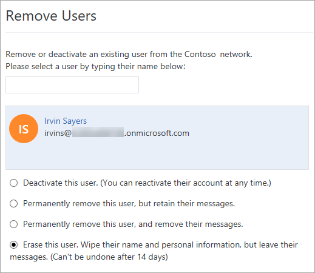

# Manage GDPR data subject requests in Yammer Enterprise

As a verified admin, you can erase a user from Yammer to comply with a [General Data Protection Regulation (GDPR) data subject request](https://go.microsoft.com/fwlink/?linkid=874693). When you erase a user, personally identifying information about the user is removed. This does not remove the user's messages or files. You can review a user's messages and files in order to decide which ones to delete. Any content associated with the user that remains will be identified with an ID, but not with the user's name.

Choose the approach that makes sense for your situation, and **follow the steps in the order listed**. The order matters: once you erase a user you can no longer find their data to delete it.

|||
|:-----|:-----|
|**Approach**|**Steps**|
|Keep all messages and files created by the user.|Remove the user by using the **Erase the user** option. This removes the user from the home network and any external networks they belong to, but does not delete any of their messages or files.|
|Delete all messages created by the user and decide which files to delete|1. Do one per-user export of the user's data for the home network, and one for each external network they belong to. 2. Remove the user from each network by using the **Permanently remove this user, and remove their messages** option. 3. In the home network, use the **Erase the user** option. 4. Within 14 days, remove any files stored in Yammer in the home network as necessary, as well as any information not included in the per user export.*|
|Review files and messages created by the user and decide which to keep and which to delete|1. Do one per-user export of the user's data for the home network, and one for each external networks they belong to.  2. In the home network, use the **Erase this user** option.  3. Within 14 days, remove any files or messages as necessary from the home network, as well as any information not included in the per user export.*|

 \* If you prefer to have more than 14 days to review and delete files and messages, you can do this prior to erasing the user.

> [!IMPORTANT]
> Closing an AAD account does not delete the user and their information. To delete user information you must go the Yammer admin center and complete the instructions provided below.

## Delete specific messages or files

Use the Yammer file ID from the export to go directly to the file in Yammer and delete it.

> [!IMPORTANT]
> For Yammer files stored in SharePoint, delete the files from Yammer in order to remove the Yammer metadata as well as the file.
  
**To locate and delete a specific message:**

1. In the data export, find the URL for the message in the **gdpr_delete_url column**. The URL will have this syntax: **https&#58;//www&#46;yammer&#46;com**/*network_name*/**#**/**Threads**/**show?threadId=** *thread_id*. For example, http&#58;//www&#46;yammer&#46;com/contosomkt&#46;onmicrosoft&#46;com/#/threads/show?threadID=135893.
  
2. In the message, click the **More** icon , and then click **GDPR Hard Delete**.

**To locate and delete a specific Yammer file stored in Yammer or SharePoint:**

  - Use the **Search** box in Yammer. For example, for a file named 12345678.pptx in the export, search for 1235678.pptx. In the search results, click **Go to File**, and then click **Delete this File**.

  - You can also build the URL for the file. Use **https&#58;//www&#46;yammer&#46;com**/*network_name*/**#**/**files**/*file_number*, for example https&#58;//www&#46;yammer&#46;com/contosomkt&#46;onmicrosoft&#46;com/#/files/12345678. On the Yammer page for the file, click **Delete this File**. 

## Find and delete user data not included in the per-user export

There is some user data that is not included in an export. To find this data for a user, go to Yammer settings  \> **People**, and click the name of the user.
  
The following table shows how to change or delete this data if needed.
  
****

|**Type of data**|**How to change or delete it**|
|:-----|:-----|
|Bookmarked messages, group membership, followed or following users, and followed topics    |When you select the [Erase a user from your Yammer home network and external networks](gdpr-requests-in-yammer-enterprise.md#RemoveUser) to remove a user from Yammer, this information is deleted after the 14-day suspension period.    A user can change or delete this information. For steps, see [Tips for staying organized in Yammer](https://support.office.com/article/40ae9666-75c0-4254-a84c-d87a9542f380.aspx).    |
|User settings, including notification, application, and language settings    |When you select the [Erase a user from your Yammer home network and external networks](gdpr-requests-in-yammer-enterprise.md#RemoveUser) to remove a user from Yammer this information is deleted after the 14-day suspension period. As an admin, you can't change this information for a user.  A user can change their own settings. For steps, see [Change my Yammer profile and settings](https://support.office.com/article/a3aeca0e-de34-4897-9b59-de6516542851.aspx).    |
|User profile    | If the user has a Yammer identity, there are two options:   - When you select the [Erase a user from your Yammer home network and external networks](gdpr-requests-in-yammer-enterprise.md#RemoveUser) to remove the user from Yammer, this information is deleted in Yammer after the 14-day suspension period.  - The user has full control of their own profile, and can modify the values. For information, see [Edit the user's profile and settings (done by user)](gdpr-requests-in-yammer-enterprise.md#EditProfile).   If the user has an Office 365 identity, the Yammer user profile is pulled automatically from Office 365, which gets the profile information from Azure Active Directory (AAD). Yammer users can temporarily change their profiles in Yammer, but these changes are overwritten when there is a change in AAD, so to permanently change or delete a user's profile, you must change or delete directory data in Office 365 and AAD. See [Manage Yammer users across their lifecycle from Office 365](https://support.office.com/article/365-6c4c8fff-6444-404a-bffc-f9da0bcc3039.aspx) and [Add or change profile information for a user in Azure Active Directory](https://go.microsoft.com/fwlink/?LinkId=871865).    |

## Edit the user's profile and settings (done by user)

A user can edit their own profile. Administrators can't change the user profile or settings.
  
- The user can click the Yammer settings icon , and then click **Edit Settings**.

- Select the tab for the change you want to make:

  - To change your profile, select **Profile**.

  - To change your password, select **Password**.

  - To edit your notifications, select **Networks**.

  - To see your account activity, select **Account Activity**.

  - To see what applications you've installed, select **My Applications**.

  - To set preferences, select **Preferences**.

## Remove a user from a group including an external group

1. In the group, select **Members**.

2. Select the Settings icon  next to the user's name.

3. Select **Remove from group**.

## Remove an external participant from a conversation

- In the Yammer conversation, click **Remove Participants**.

## Erase a user from your Yammer home network and external networks

> [!IMPORTANT]
> When you erase a user, there is a 14-day window for you to decide which files and messages to save or delete in the home network before the user-identifying data is completely erased. If you want to review and delete some or all of the user's messages and files, be sure to export user data and do the deletions before erasing the user's account, or within 14 days after selecting **Erase this user**. After the 14-day window, files and messages will continue to exist but will be marked as belonging to a former user.  After a user's account transitions from deactivated to removed, you can no longer associate user data with the user, which means you can no longer export and review their data.

> [!IMPORTANT]
> If you want to review and delete messages and files in external groups, external threads, and networks that the user is a guest member in, follow the instructions in [Delete specific messages or Yammer files stored in Yammer or SharePoint](gdpr-requests-in-yammer-enterprise.md#DeleteMessagesFiles) *before*  erasing the user. As soon as you click **Erase this user**, you will no longer be able to associate the user with these messages and files.

> [!IMPORTANT]
> Removing a user from their home Yammer network will also remove them from all external networks. You must remove guest users separately in each external network they are a member of.
  
When you erase a user, the following user data is deleted:
  
- Who the person is following, the connection to conversations and topics they were following, and the connection to users who were following them

- Bookmarks, language preferences, notification settings, and account activity

- Profile

- Group memberships

- The list of networks they were a member of

As an admin, you can erase a user from your home network and from any external networks they belong to.
  
 **Remove a user (done by admin)**
  
1. In the Yammer admin center, go to **Users** \> **Remove Users**.

2. Enter an existing user's name. After you select the user, the options for removal are displayed.

    

    - If you want to delete all a user's messages before you erase the user:

      1. Select **Permanently remove this user and remove their messages**, and then click **Submit**.
      2. When that completes, select **Erase this user**. This removes the user's name and activity data.

         - If you want to keep all the user's files and messages, select **Erase this user**.

         - If you want to review the user's messages and files, and if you have already reviewed and deleted any messages or files in external groups, threads, or networks the user is a guest member in, then do this:

        1. Select **Erase this user. Wipe their name and personal information, but leave their messages. (Can't be undone after 14 days):** This deactivates the user for 14 days so that you can export user data and evaluate home network files and messages before the user is permanently deleted.

           This option marks the user as deactivated. The deactivated user is listed on the **Remove Users** page. Within 14 days, you can reactivate the user.

           
  
           After 14 days, a message is sent to all the networks admins and verified admins informing them the user has been deleted.

        2. Click **Submit**.

        3. In the confirmation dialog, click **Yes, Permanently Delete Account**.

        4. Within the 14 days, follow the directions in [Delete specific messages or files](gdpr-requests-in-yammer-enterprise.md#DeleteMessagesFiles).

## Reactivate a deactivated account after using Erase this user

When a user's account gets deactivated by using the **Erase this user** option, you have 14 days to reactivate the user.
  
1. Go to the Yammer Admin center.

2. Click **Remove Users**.

3. Go to the **Deactivated Users** section. This section will only be visible when there is at least one deactivated user account.

4. Click **Reactivate** for each user you want to reactivated. 

    After 14 days, the user cannot be reactivated.

## Related articles

[Manage Yammer data compliance](manage-data-compliance.md)
  
[Manage GDPR data subject requests in Yammer Basic](gdpr-requests-in-yammer-basic.md)
  
[Export data from Yammer Enterprise](export-yammer-enterprise-data.md)
