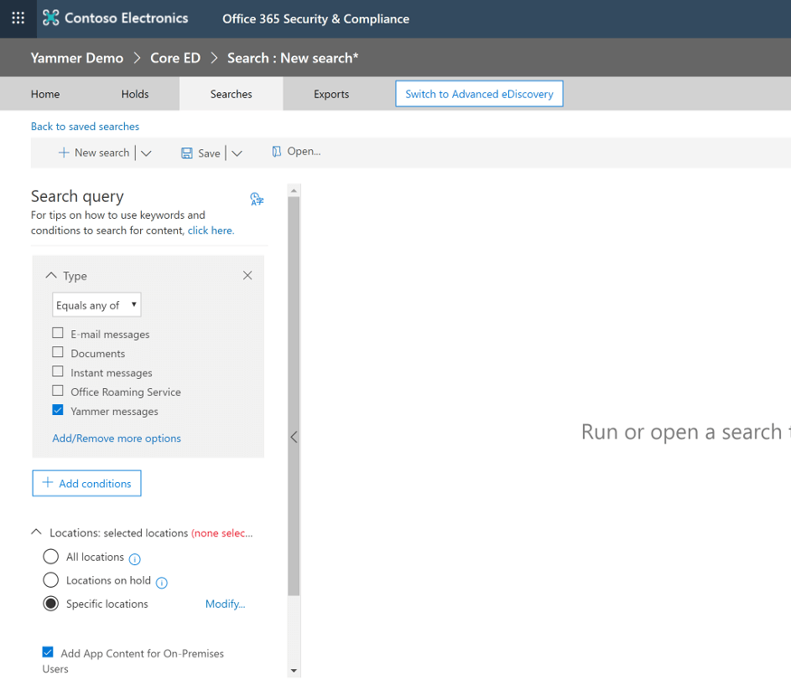
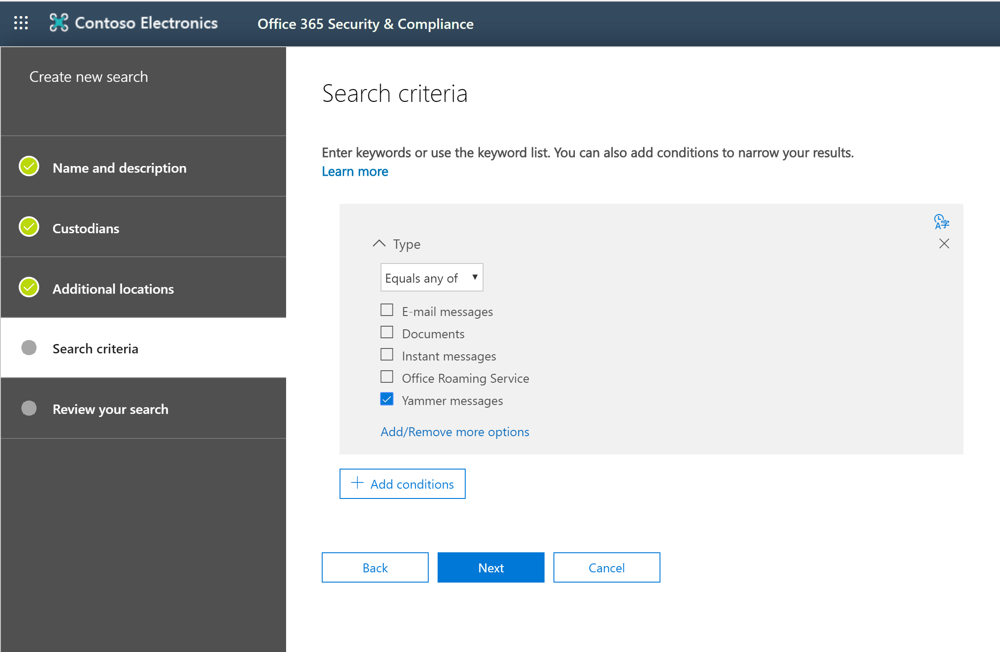

# Overview of eDiscovery in Yammer networks

Yammer now supports both eDiscovery and Advanced eDiscovery within the Microsoft 365 Compliance Center.

To use this functionality, your Yammer network will need to be in Native Mode. If your network was provisioned after January 9th, 2020, you are already in Native Mode. If your network was provisioned *before* January 9th, 2020, you will need to follow the steps in the [Overview of Native Mode](../configure-your-yammer-network/overview-native-mode.md).

You can learn more about eDiscovery in the [Microsoft 365 Compliance Center](/microsoft-365/compliance/).

The processes outlined in the above documentation explain how to run eDiscovery searches on all your Microsoft content. While Yammer isn’t discussed explicitly in those documents, the same processes mentioned there apply to Yammer content. When writing a search query in either eDiscovery or Advanced eDiscovery, you can filter on Yammer content specifically by selecting **Yammer Messages** as the *Type* of content as shown in the screenshots below.

## eDiscovery

## Advanced eDiscovery

> [!NOTE]
> You do not need to select Yammer messages as the Type to ensure Yammer messages will be included in your results. This option allows you to filter so that your results only include Yammer messages.

When viewing Yammer content in the eDiscovery tools, you can expect the following information to be available:

- Message Body
- Author
- Recipients
- Timestamp

We plan to continue updating the service to include more information not listed above.

## See also

[FAQ: eDiscovery](./faq-ediscovery.md)

[eDiscovery in Microsoft 365](/office365/securitycompliance/ediscovery)

[Overview of the advanced eDiscovery solution in Microsoft 365](/office365/securitycompliance/office-365-advanced-ediscovery)

[Overview of Native Mode](../configure-your-yammer-network/overview-native-mode.md)