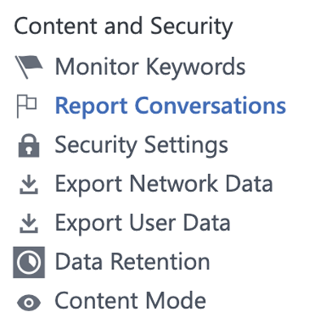
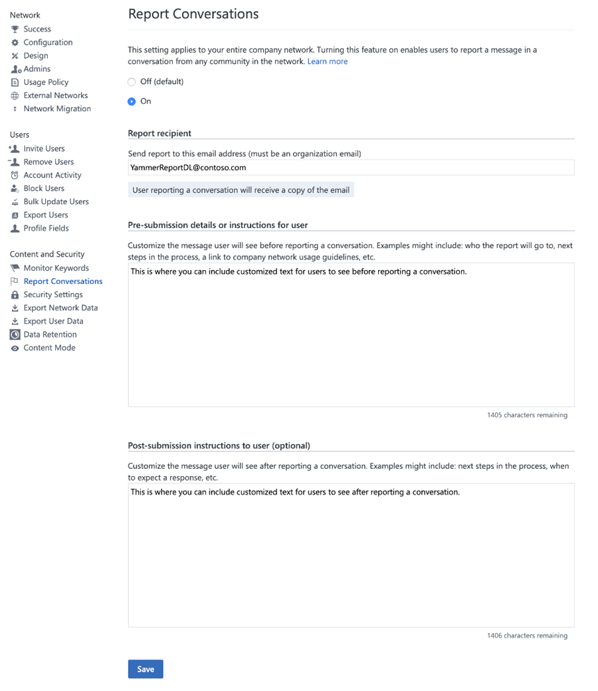
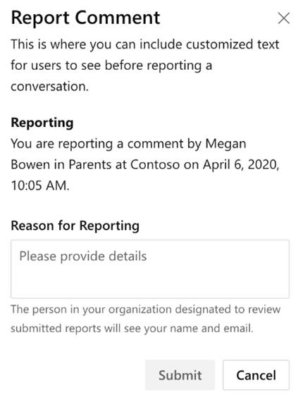
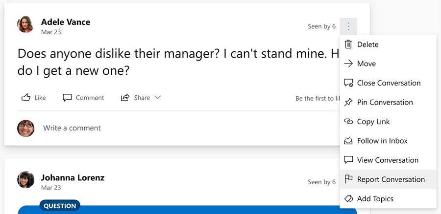
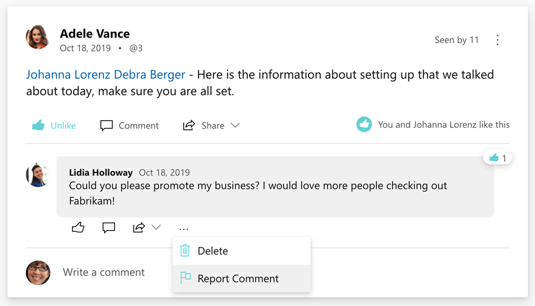
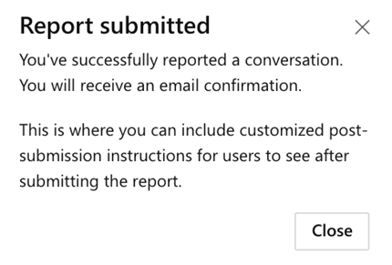
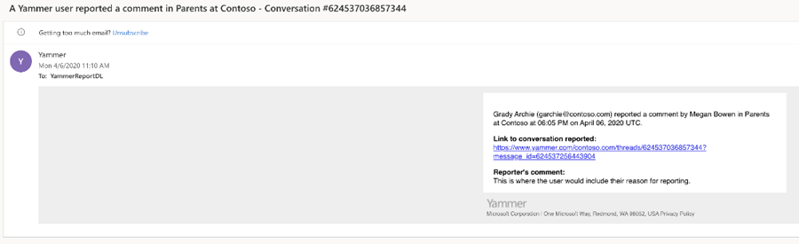

# Report a Yammer conversation overview

 Yammer Networks that are in the New Yammer Preview now have access to a new report conversations capability that enables users within the network to report conversations, comments, and replies in Yammer.

If your network is eligible, you can enable the feature in the Yammer admin center. On the **Network Admin panel**, under **Settings**, you will see a new Report Conversations option under **Content and Security**. This feature is not yet available on the mobile app.

## Setting up the report a conversation feature

A network admin must enable **Report Conversations** in the Yammer network admin panel.

After enabling conversations, enter information for the following two settings:

- **Report recipient (an organization email address)** - This is the email address to which reports will be sent.
- **Pre-submission details or instructions for user** – The text you enter here is shown to users when they click **Report a Conversation**, before they submit a report

There’s also an optional Post-submission instruction to user setting**. These instructions are shown to users once they have finished submitting a report on a conversation or comment.

## Report recipient

An organization email must be provided for where the report will be sent.

> [!NOTE]
> Yammer does not verify that the email address entered here is an organization email address. Please ensure you enter only a valid organization email address.

## Pre-submission details or instructions for user

Use this field to explain to your employees what reporting the conversation, comment, or reply will entail. The text entered in this field will be shown to your end users when they start the process of submitting a report and before they submit the report to help them understand what to expect.

Some things you may consider including are:

- details you want users to submit when reporting conversations or replies.
- who in your organization the report will go to.
- what the next steps in the process are.
- a link to company network usage guidelines, etc.

The text you enter will be displayed under the **Report Conversation** or **Report Comment** header when a user reports a conversation or comment. You can enter a maximum of 1500 characters.

## Post-submission instructions to user

Use this field to explain to your employees what will happen once a report has been successfully submitted.

The text entered in this field will be shown to your end users when they have finished submitting a report. This text is optional. It can help your end users better understand what comes next once the report has been submitted. Some things you may consider including are:

- when a user can expect a response.
- what steps are taken next by the organization, etc.

The text entered in this field will be shown to your end users underneath a default *You’ve successfully reported a conversation* message, once the report has been successfully submitted. You can enter a maximum of 1500 characters.

## End user experience for reporting conversations

When enabled, users accessing Yammer on a web browser will see the **Report Conversation** option on conversation starters and **Report Comment** on comments and replies.

**Report Conversation option on conversation starter**

**Report Conversation option on conversation comment**

Users will then see out a right panel pop with the custom message from the network admin and a required **Reason for Reporting box.**

The conversation or comment reported, along with who is reporting and the reason for reporting, will then be sent to the email specified in the **Report Conversations8** settings.

Upon successful submission, the user will then see the optional custom message from the network admin. They will also receive a confirmation message with a link to the conversation, comment, or reply reported and the comment included in the report.

## Report Emails

Upon successful report submission, the following will occur:

The organization email set for Report Conversations in admin settings will receive an email including: 
- The name of the person who submitted the report.
- whether a conversation starter or comment is being reported. The title and text of the email indicates whether a conversation starter or comment is being reported.
- the name of the person who started the conversation or wrote the comment being reported.
- the community in which the reported conversation or comment was made.
- the date and time at which the reported conversation or comment was made. 
- a link to the specific conversation starter.
- any comments entered by the reporting user.

> [!NOTE]
> Yammer does not support deep links to comments today. In the report emails for both conversation starters as well as comments, the link included in the report is always the conversation starter link. Reports do not contain deep links to a reported comment. The report reviewer can use the conversation starter link together with the reported comment timestamp to find the actual reported comment in the conversation.

A copy of this same email is also sent to the Yammer user who submitted the report.

## FAQ

**Q:** I’m an admin, and how do I know if my Yammer network is eligible for reporting conversations and comments?

**A:** Only networks that are in the New Yammer Preview are eligible for the reporting conversations experience. In the Yammer network admin center, if your network is eligible, you should see Report Conversations under Content and Security.

**Q:** Can I add multiple emails for the reports to be sent to?

**A:** Currently only one email can be used. We suggest you create and use a group email or distribution list alias if you would like the reports to go to multiple people.

**Q:** If my Yammer network is eligible for this, is it already on?

**A:** No, the feature is off by default. A network admin must turn on the feature for network users so they can see the option to report conversations and comments.

**Q:** Can users report conversations from external networks?

**A:** No, The report conversations end user experience and actions are only available in the New Yammer Preview. Networks that are in the New Yammer Preview do not have the new Yammer experience on external networks, and as a result, conversations in external networks cannot be reported.

**Q:** Can users report conversations from the Yammer mobile app?

**A:** No, not yet. At this time, conversation reporting is only available from the New Yammer Web experience.

**Q:** Can users report private messages or messages in the Yammer Inbox?

**A:** No, The report conversations end user experience and actions are only available on conversations within communities and the discovery feed.

**Q:** Can users report messages from private and secret communities?

**A:** Yes, conversations can be reported from all communities within Yammer – public, private, and secret. The email report that is sent includes a link to the original conversation starter where the starter or comment was reported. If the person reviewing the reports does not have access to the private or secret community, they can work with the network admin to either get access to that community to review the message or with the community administrator to get access to the reported message.

**Q:** Can users report messages from Yammer integrations with Teams, Outlook, and SharePoint?

**A:** No, not yet. At this time, conversation reporting is only available from the New Yammer Web experience.
