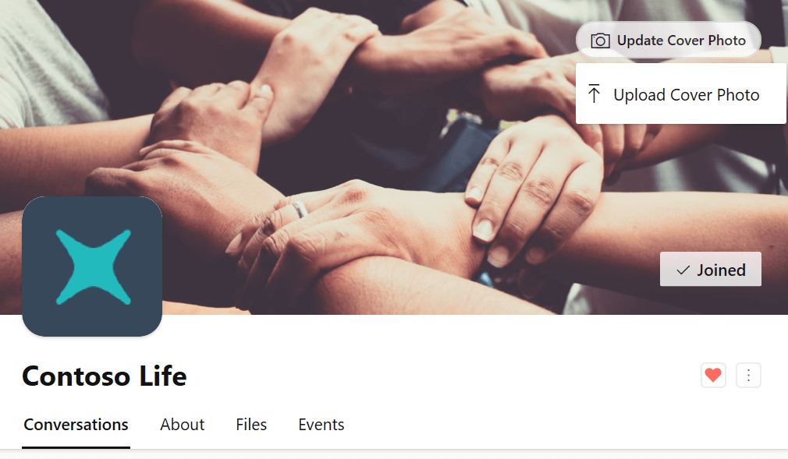
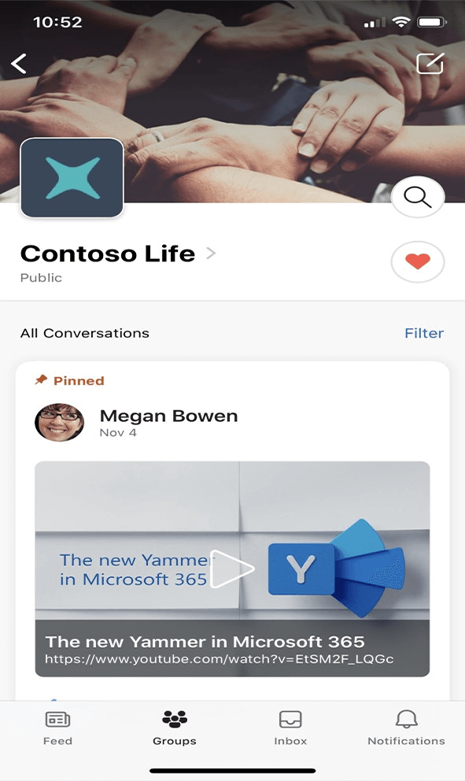

# Favorite communities

In the new Yammer experience in both web and mobile, users can add Favorite communities. After adding a community as a Favorite, it is pinned to the top of your communities list. A user can add up to ten (10) Favorite communities.

## To add/remove a Favorite from a community header

On the Yammer web and in the mobile app, in the bottom right corner of the community header, there is a heart icon. If this icon is unfilled, , then you can select the icon to add the community to your Favorite communities list. Once the heart icon is filled, , then the community is a Favorite and appears at the top of your community list.

To remove a Favorite community from the list, select the heart and it will appear unfilled. Now this community is no longer a favorite and will not be at the top of your communities list.

## See also

[Customize your Yammer community](customize-your-yammer-community.md)

[Customize your network](customize-your-network.md)
