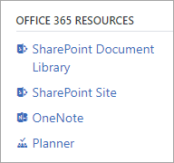

# Yammer and Office 365 Groups

If your Yammer network is eligible, you can use Office 365 connected groups in Yammer. You can tell if a group in Yammer is an Office 365 connected group when you see the **Office 365 Resources** section in the right navigation of the Yammer group: 
  

## Advantages of using Office 365 connected groups
Office 365 connected groups have many advantages over non-connected Yammer groups:
- Access Office 365 services, including a SharePoint Online team site and document library, a OneNote notebook, a plan in Planner, from within Yammer. Also includes integration with Power BI and Stream.
- Create and host live events ([Live events in Yammer](../manage-yammer-groups/yammer-live-events.md))
- Use Office 365 connectors to add apps to Yammer ([Add apps to Yammer](https://support.office.com/en-us/article/Add-apps-to-Yammer-bbb77f10-8779-4f3d-8096-db256f8653b8))
- Manage who can create Office 365 groups ([Manage who can create Office 365 groups](https://support.office.com/en-us/article/manage-who-can-create-office-365-groups-4c46c8cb-17d0-44b5-9776-005fced8e618?ui=en-US&rs=en-US&ad=US))
-  Use dynamic groups to automatically update group membership from Azure Active Directory ([Create a dynamic group](../manage-yammer-groups/create-a-dynamic-group.md))
- Edit group membership from various apps. Changes to membership made in one Office 365 app apply to other Office 365 apps.
- Use data classification to create your own classifications of Office 365 groups, such as unclassified, corporate confidential, or top secret. ([Configuring group settings](https://docs.microsoft.com/en-us/azure/active-directory/users-groups-roles/groups-settings-cmdlets))
- See the group in the Global Address List (GAL) in Outlook.
- Monitor group usage with the Office 365 groups activity report. ([Office 365 Groups activity report](https://support.office.com/en-us/article/Office-365-Reports-in-the-admin-center-Office-365-groups-a27f1a99-3557-4f85-9560-a28e3d822a40))
- Create optional groups naming policies. ([Office 365 Groups naming policy](https://support.office.com/en-us/article/office-365-groups-naming-policy-6ceca4d3-cad1-4532-9f0f-d469dfbbb552?ui=en-US&rs=en-US&ad=US))
- Use the optional group expiration policy to help clean up unused groups. ([Office 365 Group Expiration Policy](https://support.office.com/en-us/article/Office-365-Group-Expiration-Policy-8d253fe5-0e09-4b3c-8b5e-f48def064733))
- Use planned additional features that will only be available with connected groups. This includes getting local data center residency for newly uploaded files that are stored in SharePoint. ([Office 365 Roadmap](https://fasttrack.microsoft.com/roadmap))
  
## Yammer configuration required to use Office 365 connected groups 

To use Office 365 connected groups in Yammer, make sure your Yammer network meets the following requirements:

- Your Yammer network must be in a 1:1 network configuration. This means you have one Yammer network that is associated with one Office 365 tenant. This is required as of October 16, 2018. For more information, see [FAQ: Consolidating multiple Yammer networks](../configure-your-yammer-network/faq-consolidate-multiple-yammer-networks.md).
    
- You must [enforce Office 365 identity](../configure-your-yammer-network/enforce-office-365-identity.md) for Yammer users. 
    
Only groups owned by users with Office 365 group creation privileges are connected to Office 365. In other words, any groups that are owned by people who cannot create new Office 365 connected Yammer groups will not see their existing Yammer groups get connected to Office 365.
  
## Email and Office 365 connected groups

In a connected group, you can have group conversations in Yammer or in Outlook.
  
You can send an email to a group in Yammer and it will appear in the group messages. Additionally, the Office 365 connected Yammer group's name is in the global address list (GAL) of your company. Your company can continue to use groups in Yammer and Groups in Outlook based on which group type better fits the scenario for a team.
  
Email notifications may be sent to users depending on the preferences that they have set in their Yammer notification settings. This applies both to connected and non-connected groups.
  
## Plans for additional integration with Office 365 Groups

Yammer's integration with Office 365 Groups started in 2017. Subsequent phases will address remaining groups types, Office 365 tenants, and deliver integration with Outlook calendar and enhancements for SharePoint and Planner. The best place to stay informed of change management is to follow the Yammer updates on the [Office 365 Roadmap](https://fasttrack.microsoft.com/roadmap).
  
## FAQ

 **Q: I'm an admin, how do I know if my Yammer network is configured correctly and eligible for Office 365 connected Yammer groups?**
  
A: In the Yammer admin center, click **Security Settings**. In the **Office 365 Connected Yammer Groups** section, you'll see the status for your network. 
  
 **Q: Can I disable Office 365 Yammer Connected Groups?**
  
A: No, but you can [Manage who can create Office 365 Groups](https://support.office.com/article/4c46c8cb-17d0-44b5-9776-005fced8e618). These restrictions do not apply to tenant admins.

**Q: If I restrict who can create Office 365 Groups for my tenant, will the groups that restricted users create in Yammer be Office 365 connected?**
  
A: No. Groups created by people who you have restricted from creating Office 365 groups will not be Office 365 connected.
  
 **Q: If I have multiple Yammer networks that are mapped to Office 365, will the** **Office 365 connected Yammer groups work?**
  
A: No. The Office 365 connected Yammer groups experience will work only for Office 365 tenant that is associated with a single Yammer network. See [Network migration: Consolidate multiple Yammer networks](../configure-your-yammer-network/consolidate-multiple-yammer-networks.md) for information on how to consolidate your Yammer networks. This  is required for all Yammer networks as of October 16, 2018.
  
 **Q: What kinds of Yammer groups can be Office 365 Groups?**
  
A: To start with, only private and public internal groups will be enabled. External groups and private-unlisted groups will be included in a later wave.
  
 **Q: Can I make my Office 365 connected Yammer group private and not list it in Group Directory (secret)?**
  
A: No. That setting is not available for Office 365 connected Yammer groups.
  
 **Q: Where can I create Office 365 connected Yammer groups?**
  
A: Only in Yammer.
  
 **Q: Can I create an Office 365 connected Yammer group in the Office 365 admin center?**
  
A: No, this will be added in later waves. However, you will be able to manage members and delete groups from the Office 365 admin center. Metadata updates can also be applied to groups from the admin center.
  
 **Q: Can I add external users to** **Office 365 connected Yammer groups?**
  
A: No. This will cause a sync failure because external users are not managed by Azure AD.
  
 **Q: I don't want my existing groups to get connected to Office 365. Can I turn this off?**
  
A: No, but you can [Manage who can create Office 365 Groups](https://support.office.com/article/4c46c8cb-17d0-44b5-9776-005fced8e618) which will also apply to the backfill for existing groups. Only groups owned by users with group creation privileges will be connected to Office 365. If you apply new a creation policy, this will not retroactively change groups that are connected to Office 365. This will only impact new groups moving forward. 
  
 **Q: If I become eligible for connected groups, what happens?**
  
We will begin connecting your existing groups as new groups get connected.
  
 **Q: How many members can my group have?**
  
A: More than 1,000.
  
 **Q: What happens if I delete an Office 365 connected Yammer group?**
  
A: As with all Office 365 groups, all the content associated with the group is deleted. This includes the document library, OneNote notebook and Planner plans. See this article about [Delete a group](https://support.office.com/article/ca7f5a9e-ae4f-4cbe-a4bc-89c469d1726f) for details. 
  
 **Q: Can I have a group with dynamic membership in Yammer**
  
A: Yes. Any Office 365 connected Yammer group can be converted to dynamic membership. See [this article](create-a-dynamic-group.md) for requirements and limitations.
  
 **Q:** **In a new group, I see there are Yammer Files and a SharePoint Online Doc Library, are these the same thing?**
  
A: No, these are separate locations to store files but the members of the group have access to both locations. Files uploaded to Yammer are stored in Azure today and will remain so for the time being, while retaining all their current permissions and capabilities. With Office 365 connected Yammer groups, users will also be able to upload and store files in their group's SharePoint document library. 
  
We recommend storing content that needs the structure and management capabilities of SharePoint in the group document library. For easy, quick sharing of images and documents, or to stream videos in Yammer, we recommend continuing to use Yammer. Longer term, our plan is to migrate all files stored in Yammer to SharePoint to provide unified file storage.
  
 **Q: Do my Office 365 connected Yammer groups follow my Office 365 group naming policy?**
  
A: Yes. Any new group created in Yammer will add the prefix and suffix from the group naming policy, and will not allow blocked words in the group name. For more information, see [Office 365 Groups naming policy](https://support.office.com/article/6ceca4d3-cad1-4532-9f0f-d469dfbbb552).
  
 **Q: How does Office 365 First Release fit into Yammer integration with Office 365 Groups?**
  
A: Yammer uses A/B Testing to inform product decisions which is a process that includes all users in all networks. You cannot opt-in nor opt-out to Yammer A/B Testing. Other Office 365 properties like SPO and Planner employ the Office 365 First Release program which may manage access to new capabilities and changes within that technology. For more information on Office 365 First Release program, see [How Office 365 commercial customers can get early access to new Office 2016 features](https://support.office.com/article/4dd8ba40-73c0-4468-b778-c7b744d03ead).
  
## See also

[Create a group in Yammer](https://support.office.com/article/b407af4f-9a58-4b12-b43e-afbb1b07c889)
  
[Manage a group in Yammer](https://support.office.com/article/6e05c6d6-5548-4c88-89cd-e6757a514ef2.aspx)