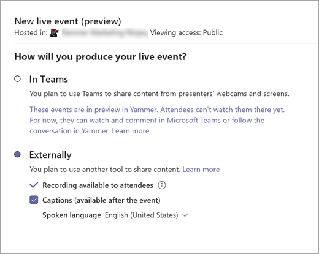
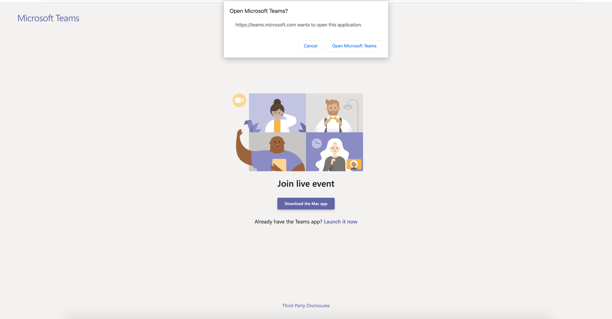
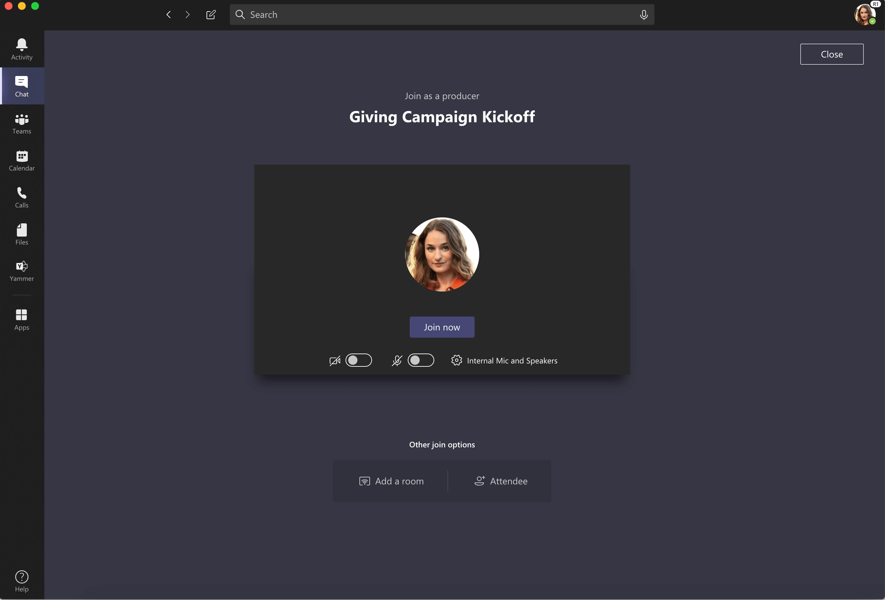
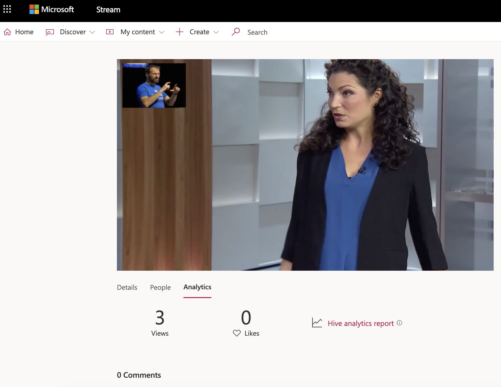

# What is new about Yammer live events?

Live events produced using Teams can now be scheduled and viewed in Yammer! This is one of the largest customer asks we have and we’re excited to release this new functionality.

## Benefits

- Schedule live events directly within Yammer (takes less than 30 seconds end-to-end)
- Attendees can view a Teams produced event in Yammer (for all events scheduled from Yammer)
- Use Teams to produce your live event (no external app or device!)
- Get access to all the analytics available from Microsoft Stream
- Question and Answer + regular Yammer events feed is available
- All events are stored in Stream (and are searchable there, like any other live event)

For the full list of features, see [Overview of live events](yammer-live-events.md).

## FAQ

## How can I use Teams to produce an event in Yammer?

- Schedule the event (double-click to watch the video)
[COMING SOON]

- Share the event from Yammer

- When it’s time to go live, produce/present from Teams as usual

- See the event LIVE in Yammer! All attendees can view this event directly from Yammer.

## What is the difference between this feature and what is available in GA today?

The main benefit of this feature is that all attendees can view a Teams-produced event in Yammer. We’ve worked with Teams and Stream to make this available for our Yammer customers. Now, event organizers can schedule their event in Yammer, produce it using Teams, but view it in Yammer.

A few things to note:

- Just like any live event: only admins in connected communities can create an event

- With this flow, the event is still produced in Teams (producers/presenters must use Teams to produce/present)

- Analytics are available in Stream (rather than Teams)

- The event will not automatically be added to a producers/presenters’ calendar at this time (under active investigation)

## Who can use this feature?

Only Yammer admins in connected communities.

## What kind of analytics do I get with this feature?

You get access to all the advanced analytics available via Stream.

Event producers can see the total number of watchers when the event is live. When the event is completed, the producer can see the total number of views across the lifetime of the video subject to the view count algorithm.

## Do I need a Stream and Teams license to use this feature?

Yes, both are required.

Yammer has partnered with both Teams and Stream to provide the best technology for running your live event. Because of this, creation and production of webinar style live events require Stream and Teams licenses and specific permissions. These permissions are not controlled in Yammer settings and a network admin will have to enable these permissions and they will have to be enabled for both Stream and Teams.

- **Stream**: For steps to grant or remove permissions in Stream, see [Administration controls for live events in Stream](https://go.microsoft.com/fwlink/?linkid=2117155).

- **Teams**: For requirements, see [Who can create and schedule live events in Teams](https://go.microsoft.com/fwlink/?linkid=2117055). For steps to set policies, see [Set up for live events in Microsoft Teams](https://go.microsoft.com/fwlink/?linkid=2117054).

## How many concurrent viewers can watch this event?

Currently, live events support up to 10,000 concurrent viewers. For more information, see [Microsoft Stream live event overview](https://docs.microsoft.com/stream/live-event-overview).

## What is the maximum duration of an event?

Four (4) hours.

## Who can watch a live event?

Viewers who are part of the community which the event is in.

|**Feature**|**Produced using Teams**|**Produced using Encoder**|**More info**|
|----------|----------|----------|----------|
|Analytics|Yes|Yes|See [Analytics about your live event in Microsoft Stream](https://docs.microsoft.com/stream/ecdn). See [Monitor your event](https://docs.microsoft.com/yammer/manage-security-and-compliance/track-yammer-events) for more information|
|Schedule in Yammer|Yes|Yes|N/A|
|Produce in Yammer|No|Yes|N/A|
|Attendees view event in Yammer|Yes|Yes|N/A|
|Attendees view event in Stream|Yes|Yes|N/A|
|Attendees view event in Teams|No|No|At this time, events scheduled from Yammer cannot be viewed in Teams. If you're looking to produce and view your Live Event in Teams only, then we recommend you use Teams Live events to fulfill this scenario! For more information on events produced and viewed exclusively in Teams, see [What are Microsoft Teams live events](https://go.microsoft.com/fwlink/?linkid=2117154).|
|Yammer event feed|Yes|Yes|N/A|
|Q&A support|Yes|Yes|N/A|
|Share event using attendee link|Yes|Yes|N/A|
|Event is automatically added to calendar for producers/presenters|No|No|At this time, events are not automatically added to producers/presenters calendars. We are evaluating adding this feature to our roadmap for the future.|
|Automatic speech-to-text and captions|Yes|Yes|N/A|
|On-demand viewing on live event (after event)|Automatic transition for live to on-demand for immediate viewing and indexing in Microsoft Stream|Automatic transition for live to on-demand for immediate viewing and indexing in Microsoft Stream|N/A|
|Downloadable recording|Processed and available after live event by owners|Processed and available after live event by owners|N/A|
|Maximum concurrent live events (in pre-live or live)|15|15|N/A|
|Active concurrent viewers|10,000|10,000|N/A|
|Maximum length of live event|Four(4) hours|Four(4) hours|N/A|
|Attendee DVR controls|Pause, playback speed (2x catch up, 1x at live), seek|Pause, playback speed (2x catch up, 1x at live), seek|N/A|
|Real-time captions|No|708 caption pass-through from encoder|N/A|
||||

> [!NOTE]
> Live events in Microsoft 365 is a highly available service and you can expect good performance at scale. In the very unlikely scenario that results in failover being required, live events scheduled from Yammer will not have redundancy and are not be recoverable.

## Related articles

[Organize a live event in Yammer](https://support.office.com/article/organize-a-live-event-in-yammer-105dd7af-9caf-4a5e-8a44-56d203e96551)

[Live events in Yammer](yammer-live-events.md)

[Attend a live event in Yammer](https://go.microsoft.com/fwlink/?linkid=2117053)

[Microsoft Teams live event overview](https://support.office.com/article/microsoft-teams-live-events-overview-d077fec2-a058-483e-9ab5-1494afda578a)

[Microsoft Stream live event overview](https://docs.microsoft.com/stream/live-event-overview)

[Get help producing a live event](https://support.office.com/article/0cedb557-cbe4-40d3-8147-112633f087eb)
