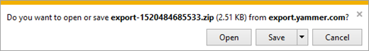

# Add, block, or remove Yammer users

As a verified or network admin, you can add, block, or remove Yammer users, and define what fields to include in their profiles. 
  
To get to the Yammer admin center to manage users:
  
- In Office 365, go to **Admin** \> **Yammer**.
    
- Or, in Yammer, click the Yammer settings icon , and then click **Network Admin**.
    
## Invite users to Yammer

If you are enforcing Office 365 identity in your network, all Office 365 users that have a Yammer license are created as pending users in Yammer. If you are not enforcing Office 365 identity, users are not part of the Yammer network until they have clicked the Yammer tile from Office 365 or logged in once to Yammer.

> [!NOTE]
> If your Yammer Network is [in Native Mode](../configure-your-yammer-network/overview-native-mode.md), this action can be performed only in the [Azure Active Directory (Azure AD) User Management Portal](https://docs.microsoft.com/azure/active-directory/fundamentals/add-users-azure-active-directory) and not within the Yammer Admin portal.

Only employees with a company email address can be invited from this screen. 
  
- If you invite a user to a group who is not licensed to use Yammer, that user will be suspended in Yammer and removed from the group member list. They will not receive announcement emails. 
    
 **Invite users a few at a time**
  
1. In the Yammer admin center, go to **Users** \> **Invite Users**.
    
2. Enter individual email addresses, and then click **Invite**. 
    
 **Invite users in bulk just specifying their email address**
  
1. In the Yammer admin center, go to **Users** \> **Invite Users**.
    
2. Click **Import an address book** and import a .CSV file exported from a file email application such as Outlook or Apple Mail. The .CSV file should include one email address on each line. 
    
 **Invite users in bulk specifying other fields**
  
- If you want to include other fields such as Job title and Full name, you can use bulk update. For instructions on formatting a .CSV file for bulk update, see [Bulk update users by importing a .CSV file](add-block-or-remove-users.md#BulkUpdateUsers).
  
    > [!NOTE]
    > If your organization uses more than one Internet domain for email addresses and you would like to add users from other domains to your network, consider performing a Yammer network consolidation. For more information, go to [Network migration: Consolidate multiple Yammer networks](../configure-your-yammer-network/consolidate-multiple-yammer-networks.md). 
  

## Manage pending users

A "pending user" is someone who has been invited to a yammer network but never logged in. Pending users can be added to groups even before they have used Yammer for the first time.

Pending users receive announcement notification emails from group admins. If users don't want to receive announcements from a particular group they can log into their Yammer account and leave the group or follow the unsubscribe link in the email to unsubscribe from all Yammer emails.

As in all Office products, pending users will be visible in the group member list even if they have never logged in.
 

## Invite guests

Invite external contacts with email addresses outside of your domain (e.g., consultants, contractors, or partners). Guest email domains are not added to the list of authorized domains for your network. 
  
1. In the Yammer admin center, go to **Users** \> **Invite Guests**.
    
2. Enter individual email addresses. Guest users, including active and pending (those who have not yet responded to their invitation), are listed on this page. 
    
    
  
As with other users, guest users' names and profiles remain blank until they accept their invitations and complete registration. Guest user accounts can be deleted any time, but their contributions to the network remain.
  
For more information about guests, see [External Messaging FAQ](../work-with-external-users/external-messaging-faq.md).
  

## Remove users

You can deactivate or permanently remove users, including users, including active and pending users and guests.

> [!NOTE]
> If your Yammer Network is [in Native Mode](../configure-your-yammer-network/overview-native-mode.md), the only reason to use the **Remove Users** page in the Yammer Admin portal is to process a [Data Subject Request for GDPR](../manage-security-and-compliance/gdpr-requests-in-yammer-enterprise.md). If you just want to remove a user from your Yammer Network, this action should be performed directly within the [AAD User Management Portal](https://docs.microsoft.com/azure/active-directory/fundamentals/add-users-azure-active-directory).

1. In the Yammer admin center, go to **Users** \> **Remove Users**.
    
2. Enter an existing user's name. 
    
3. Select an action to take:
    
      - **Deactivate this user:** 
          - If the user is not using Azure Active Directory (AAD) credentials, this blocks the user from logging on until they verify their email address again. Without access to their verified email account, they cannot log back on to Yammer. User profile information, messages, and/or file uploads remain. This can be a useful option for contract employees that have completed their project but can be renewed again later. Deactivated users can reactivate their account within 90 days by enabling their email account and logging on to Yammer, where they will receive an email with links to reactivate. After 90 days, the account is permanently deleted.

          - If the user is using AAD credentials, first use this action to deactivate the user and then also follow the instructions in [Block users]https://docs.microsoft.com/yammer/manage-yammer-users/add-block-or-remove-users#block-users. 
    
      - **Permanently remove this user and keep messages:** This lets you remove the user and retain the messages and content they posted. 
    
      - **Permanently remove this user and messages:** This lets you remove the user and all the messages they posted. This cannot be reversed. 
    
      - **Erase this user. Wipe their name and personal information, but leave their messages. (Can't be undone after 14 days):** This deactivates the user for 14 days so the admin can evaluate files and messages before the user is permanently deleted. 
    
        > [!NOTE]
        > This option is typically used for executing a GDPR data subject request. Before using this option, read [Manage GDPR data subject requests in Yammer Enterprise](../manage-security-and-compliance/gdpr-requests-in-yammer-enterprise.md). For GDPR information for all of Office 365, see [Office 365 data subject requests for the GDPR.](https://go.microsoft.com/fwlink/?linkid=874693). 
  
    All deletion options delete the following data:
    
      - Who the person is following, what conversations and topics they're following, and who's following them
    
      - Bookmarks, language preferences, notification settings, and account activity
    
      - User's profile
    
      - Group memberships
    
      - Org chart
    
      - The list of networks they were a member of
    
    The first three deletion options leave the user's name in stored Yammer data. The only way to remove the user's name is to use the **Erase this user** option. 
    
4. Click **Submit**.
    
    If there are any deactivated users, they are listed on the **Remove Users** page. You can reactivate or delete a user from this list. 
  
    
  
## Monitor account activity and device usage for a single user

1. In the Yammer admin center, go to **Users** \> **Account Activity**.
    
2. Type a user's name. You'll see what devices they are currently logged in, when they last logged in on each device, and which IP address was used. 
    
    You can also log the user off the device from this list.
    
To monitor activity and device usage for your entire Yammer network, see [Office 365 Reports in the Admin Center - Yammer activity report](https://support.office.com/article/C7C9F938-5B8E-4D52-B1A2-C7C32CB2312A) and [Office 365 Reports in the Admin Center - Yammer device usage report](https://support.office.com/article/B793FFDD-EFFA-43D0-849A-B1CA2E899F38).
  

## Block users

 Users with blocked email addresses cannot join your Yammer network unless you or another admin unblocks those addresses.

> [!NOTE]
> If your Yammer Network is [in Native Mode](../configure-your-yammer-network/overview-native-mode.md), this action can be performed only in the [Azure Active Directory (Azure AD) User Management Portal](https://docs.microsoft.com/azure/active-directory/fundamentals/add-users-azure-active-directory) and not within the Yammer Admin portal.
  
There are two ways to block users from Yammer:
  
- **Block the user by using the Yammer admin center:**
    
    Blocked users will still see a Yammer tile in Office 365.
    
    1. In the Yammer admin center, go to **Users** \> **Block Users**. 
    
    2. Enter the email address of the user to block.
    
        You can separate multiple email addresses with commas or line breaks. 
    
         If the user you select is in a suspended state in Yammer, blocking that email address puts the user in a deleted state. 
    
        > [!TIP]
        > Yammer is most effective when every post comes from an individual user. Therefore, you might want to block group email addresses. 
  
- **Block a user and remove the Yammer tile from Office 365:**
    
    1. In the Yammer admin center, go to **Users** \> **Block Users** and enter the email addresses of the users to block. 
    
    2. In the Microsoft 365 admin center, remove the **Yammer** license for the user. For steps, see [Turn off Yammer access for Office 365 users](turn-off-user-access.md) and see [Manage Yammer licenses in Office 365](manage-yammer-licenses-in-office-365.md). 
    

## Bounced emails

Yammer occasionally sends email updates to users. When an employee's email address is disabled, the emails we send bounce back. 
  
1. In the Yammer admin center, go to **Users** \> **Bounced Emails**.
    
2. If the user is no longer an employee, select the user from the list, and click **Deactivate**.
    

## Bulk update users by importing a .CSV file

> [!NOTE]
> If your Yammer Network is [in Native Mode](../configure-your-yammer-network/overview-native-mode.md), this action can be performed only in the [Azure Active Directory (Azure AD) User Management Portal](https://docs.microsoft.com/azure/active-directory/fundamentals/add-users-azure-active-directory) and not within the Yammer Admin portal.

 **\* Verified Admin Only**
  
1. In the Yammer admin center, go to **Users** \> **Bulk Update Users**.
    
2. Format your .CSV as a table and include a first line that defines the fields in the following order from left to right: Action, Email address, Full Name, Job Title, Password, and New Email. 
    
    The value in the **Action** column indicates what Yammer will do: 
    
  - **New** If you leave the password field blank, the user is created as "pending". If you specify a password, the user is created as active and immediately shows up in the **Member** directory. 
    
  - **Update** The existing Yammer account remains the same. However the other fields (name, title, password, email address) will change to match those in the .CSV. Updates to email addresses can occur only to domains that are part of your Yammer network. 
    
  - **Suspend** The user account is suspended until the user verifies their status via an email request. 
    
  - **Delete** The user account is deleted, but the user's messages and attachments remain in the network. 
    
Excel does not encode non-English characters in CSV files correctly. If you have such characters in your users' names, you can create a UTF-8 encoded CSV file in Notepad to use for bulk updates.
  
 **Use Notepad to create a UTF-8 .CSV file from an Excel spreadsheet**
  
1. Open the file in Excel, and then choose **File** \> **Save As**. In the **Save as type** box, choose **Unicode Text (\*.txt)**. 
    
2. Open the file in Notepad.
    
3. Make sure the fields in the file are delimited with commas. 
    
1. Search and replace all tabs with a comma ",".
    
2. Copy the tab character from your text, and then choose **Edit** \> **Replace**. 
    
3. In the **Find what** box. paste the tab character, and in the **Replace what** box. enter a comma and choose **Replace All**. 
    
4. Choose **File** \> **Save As**. 
    
1. In the **Encoding** box, choose **UTF-8**. 
    
2.  In the **File name** box, change the file extension to .csv instead of .txt. 
    

## Export users

1. In the Yammer admin center, go to **Users** \> **Export Users**.
    
2. Select whether to export all users, or to export only users added during a specified date range.
    
3. Click **Export**.
    
    This provides a .ZIP file containing 3 .CSV files, for admins, users, and networks. 
    
    
  
    User fields include: User ID, Email Address, Name, Job Title, Location and Joined On (the date they joined the network).
    

## Select which profile fields to include

1. In the Yammer admin center, go to **Users** \> **Profile Fields**.
    
2. Select the options to include. Profile fields are searchable to help users find each other when they look for particular information, background, or expertise.
    
> [!TIP]
> Each user can customize their individual email notification preferences by clicking the three dots in the top navigation bar and going to **Edit Profile** \> **Notifications**. They can also go to **Edit Profile** \> **Preferences** to adjust their own message and time zone settings. 
  
## Related articles

[Manage Yammer users across their lifecycle from Office 365](manage-users-across-their-lifecycle.md)
  
[Manage a group in Yammer](https://support.office.com/article/6e05c6d6-5548-4c88-89cd-e6757a514ef2.aspx)

[Can I unsubscribe myself from Yammer?](https://support.office.com/article/981ecaf7-8a7d-4312-a845-bd343e925073)

[Remove a user from a group](https://support.office.com/en-us/article/Manage-a-group-in-Yammer-6e05c6d6-5548-4c88-89cd-e6757a514ef2#removemember)
