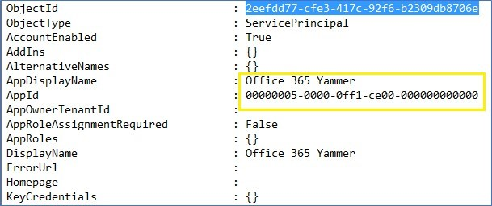

# Improve Office 365 sign-in for Yammer with auto-acceleration policy

To improve the Office 365 sign-in experience for Yammer, use the Auto-acceleration policy to accelerate directly to the ADFS federated domain, bypassing the Office 365 login page. 
  
## Prerequisites

- You must be a global administrator in Office 365 to run the PowerShell commands.
    
- Download and Install the [Azure Active Directory V2 PowerShell Module](https://www.powershellgallery.com/packages/AzureAD/2.0.2.16).
    
- Open administrative AAD Powershell and run following commands:

     > [!IMPORTANT]
     > The `Save-Module` command will download the module from the Internet. You need a working internet connection on the computer where you are running these commands. 
    
    ```powershell
    Save-Module -Name AzureAD -Path <path>
    ```

   

  
    ```powershell
    Install-Module -Name AzureAD
    ```

## Enable policy

1. Run the following commands:
    
    Connect to Tenant's Azure AD. This command will prompt you for credentials. Sign in using admin credentials.
    
      ```powershell
     connect-AzureAD [-tenantID | -tenantDomain] <tenant name>
     ```

    
  
2. Check that no policy of the same name exists already.
    
      ```powershell
      get-AzureADPolicy
      ```

3. Create a new policy:
    
  - If you have a single federated domain that will authenticate users for applications, set HRD policy by running the following command:
    
     ```powershell
      New-AzureADPolicy -Definition @("{`"HomeRealmDiscoveryPolicy`":        {`"AccelerateToFederatedDomain`":true}}") -DisplayName
       BasicAutoAccelerationPolicy -Type HomeRealmDiscoveryPolicy
    ```

    If you have multiple federated domains and have a preferred domain for your application against which users will authenticate, set Policy by typing the following command:
    
       ```powershell
     ` New-AzureADPolicy -Definition @("{`"HomeRealmDiscoveryPolicy`":{`"AccelerateToFederatedDomain`":true,`"PreferredDomain`":`"contoso.com`"}}")
    -    Displ`ayName BasicAutoAccelerationPolicy -Type HomeRealmDiscoveryPolicy
       ```

4. Note object-id of policy you've just created
    ```powershell
    get-AzureADPolicy
    ```
    

5. Note **ObjectId** of servicePrincipal for Yammer application (Redirect output to a text file for easy search). The AppDisplayName would be "Office 365 Yammer" with AppID of 00000005-00000ff1-ce00-000000000000 
    
    ```powershell
    Get-AzureADServicePrincipal -All $true | fl > output.txt
    ```
    

    
  
6. Finally, Add the policy for Yammer service.
    
      ```
      Add-AzureADServicePrincipalPolicy -ID <ObjectID of the Service Principal copied from #5> -RefObjectId <ObjectId of the Policy copied from #4>
      ```

    
  
## List of commands in order

These are the commands you must run to enable the policy. Run them one line at a time and review the output after each command:
  
```Powershell
Connect-AzureAD -TenantDomain <Tenant-Name>
get-AzureADPolicy
$PolicyId = New-AzureADPolicy -Definition
@("{`"HomeRealmDiscoveryPolicy`":{`"AccelerateToFederatedDomain`"
:true}}") -DisplayName BasicAutoAccelerationPolicyforYammer -Type HomeRealmDiscoveryPolicy
get-AzureADPolicy
$yamObjectId = Get-AzureADServicePrincipal -All $true | ?{$_.AppDisplayName -eq 'Office 365 Yammer'}
Add-AzureADServicePrincipalPolicy -Id $yamObjectId.ObjectId - RefObjectId $PolicyId.Id
```

Note: Change the third command shown above if you have multiple federated domain.
  
## Testing

In a new in-private browser session, sign in to Yammer with user credentials from the federated domain. Check that sign in flow skips AAD page and goes straight to ADFS sign in page. If it does, success!
  
## Scenarios

The following table summarizes the authorization flows for this policy.
  
|**Login**|**Flow without policy**|**Flow with policy**|
|:-----|:-----|:-----|
|Yammer.com  <br/> |Email address \> Azure AD login \> ADFS login  <br/> |Email address \> ADFS login  <br/> |
|Yammer.com/mycompany.com  <br/> |Email address \> Azure AD login \> ADFS login  <br/> |Email address \> ADFS login  <br/> |
   

