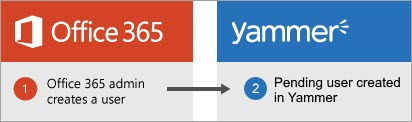
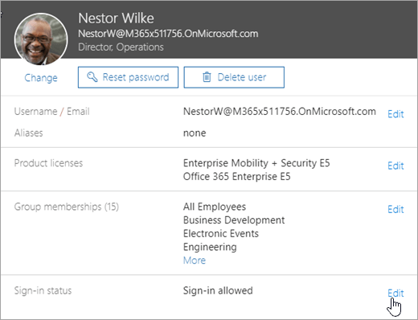
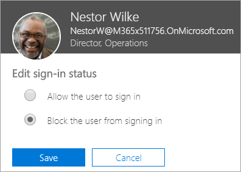
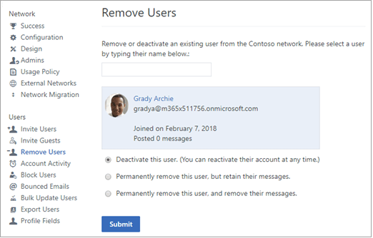
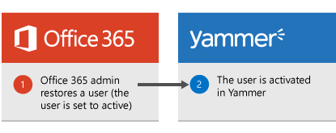
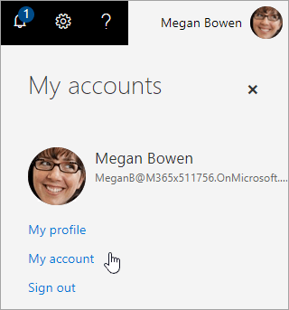
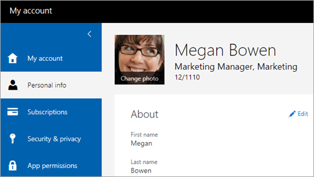
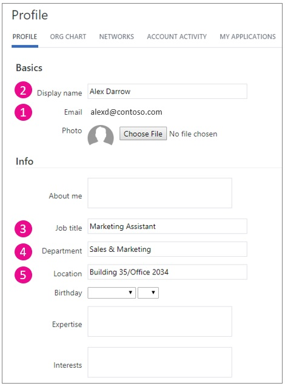
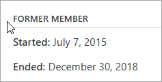

# Manage Yammer users across their lifecycle from Office 365

As a global Office 365 administrator, you control the life cycle for Yammer users from Office 365. When you create users in Office 365, they can log on to Yammer with their Office 365 credentials. When a user is deleted from Office 365, he or she is automatically deactivated or suspended in Yammer. When a user is restored in Office 365, he or she is reactivated in Yammer. 
  
The user's profile properties (such as name and department) from Azure Active Directory are automatically populated in the user's Yammer profile, and any changes to the profile properties in Azure Active Directory are reflected in Yammer as well. While Yammer users can change their profile in Yammer, the user's changes will be overwritten if the properties change in Azure Active Directory.

The user's Yammer language setting is taken from Office 365 when the user's Yammer account is activated. If the user changes their Office 365 language setting or if the setting is changed directly in Azure Active Directory, Yammer does not pick up this change. The user can change their Yammer language setting in their Yammer profile on the **Preferences** tab.
  
## Create a user

As of March 2019, we are in process of transitioning how Yammer users are created. During the transition, which will occur during 2019, the process will be different for existing Office 365 users and new Office 365 users.

- **Pre-March 2019**: Yammer users are created when they use Yammer for the first time. 
 
    > [!NOTE]
    > During the rest of 2019, Office 365 users who have not yet used Yammer will be converted to "pending" Yammer users. 

    

    The process of creating a user requires these steps:
  
    1. The Office 365 admin creates a user in Office 365.
    
    2. The user logs on to Office 365 using the identity provider that is configured for the tenant.
    
    3. The user clicks the Yammer tile in the Office 365 app launcher to go to Yammer.
    
    4. A new Yammer user is created for the Office 365 user. The user's profile properties and language setting from Azure Active Directory are automatically populated in the user's Yammer profile.

- **New way**: When **Enforce Office 365 identity** is selected in Yammer, as Yammer-eligible users are added to Office 365, they are automatically added as new pending users in Yammer. Their status changes from **Pending** to **Active** the first time they use Yammer.

    

    The process follows these steps:
  
    1. The Office 365 admin creates a user in Office 365.
    
    2. A pending user is created in Office 365. The first time the user uses Yammer, the pending user becomes an active user.

- **During transition**: Different actions are taken for different user categories:

    |**Type of user**|**Yammer network configuration**|**Way that they are added**| 
    |:-----|:-----|:-----|
    |New users added to your Office 365 tenant|**Enforce Office 365 identity** selected|Users are automatically added as pending users in Yammer. 
    | Existing users in your Office 365 tenant|**Enforce Office 365 identity** selected|Office 365 users must still use Yammer in order to be added as a Yammer user. |

    
## Block a user

An administrator can block a user in Office 365, and the user will be logged out of Yammer as well as all the other Office 365 services. Here's a diagram that shows how this works.
  

  
The process follows these steps:
  
1. The Office 365 administrator sets the user's sign-in status to **Block the user from signing in**.
    
    To do this:
    
    1. In the Microsoft 365 admin center, select a user and choose **Edit User**. The **Sign-in status** is shown in the user details, as in this screenshot. 
    
        
  
    2. Click **Edit** next to **Sign-in status** to swtich between **Allow the user to sign in** and **Block the user from signing in**, as in this screenshot.
    
        
  
    3. This action flows into Yammer, and the corresponding user is logged out of Yammer (on all devices). When this user tries to login to Yammer again from any device, he or she will be prompted to login with their Office 365 credentials. However, the user will not be able to login because their sign-in status is set to blocked. As a Yammer verified administrator, you can go to the Network Admin area, and look at the Account activity section to verify that the Yammer user has been logged out, as in the following screenshot, where the user has no active Yammer sessions.
    
        
  
## Delete a user

If an employee leaves the company, you can delete the user from Office 365. When the user is deleted from Office 365, the corresponding user is deactivated (also known as suspended) in Yammer. The following diagram shows how this works:
  

  
The process follows these steps:
  
1. An admin deletes a user from Office 365, as shown in the following screenshot:
    
    
  
2. The user deletion in Office 365 flows into Yammer, and the corresponding Yammer user is deactivated in Yammer. Specifically, the operation is equivalent of navigating to Yammer administration, choosing **Remove Users**, and then selecting **Deactivate this user**, as shown in the following screenshot:
    
    
  
    Users who are deactivated (or suspended) this way will show up in Yammer administration pages as being deactivated by **System Administrator**, as shown in the following screenshot: 
    
    
  
3. When you delete a user in Office 365, the user becomes inactive. After approximately 30 days, user data gets permanently deleted. See [Delete a user from your organization](https://support.office.com/article/d5155593-3bac-4d8d-9d8b-f4513a81479e).
    
    Similarly, when a user is deactivated in Yammer, that user becomes inactive in Yammer. After approximately 90 days, deactivated users are permanently removed, but their name, files, messages and activity data are retained. 
    
    > [!IMPORTANT]
    > When you delete a user from Office 365 and this flows through to Yammer, the user's name, files, messages, and activity data remain in Yammer even though the user is deleted. For options that remove a user in a way that the user's name and data are also deleted from Yammer, see [Remove users](add-block-or-remove-users.md#RemoveUsers) and [Manage GDPR data subject requests in Yammer Enterprise](../manage-security-and-compliance/gdpr-requests-in-yammer-enterprise.md). 
  
## Restore a user

When an administrator restores a Yammer-eligible user in Office 365, the user will be reactivated in Yammer. The following diagram shows how this works:
  

  
The process follows these steps:
  
1. The Office 365 administrator can restore a deleted user in Office 365, as shown in the following screenshot:
    
    
  
2. This action flows into Yammer as well, and the previously deactivated user in Yammer is reactivated.
    
## Yammer user profile update from Azure Active Directory

Office 365 uses the cloud-based service Azure Active Directory (Azure AD) to manage users. You can either manage users directly in the cloud or use [Understanding Office 365 identity and Azure Active Directory](https://support.office.com/article/06a189e7-5ec6-4af2-94bf-a22ea225a7a9) to create and synchronize users/groups from your on-premises environment. When Office 365 users who are new to Yammer access Yammer for the first time using their Azure AD credentials, a Yammer user is created, and the Yammer user profile is populated with the Azure AD user properties. And when the user's profile properties are edited in Azure AD, they are updated in the existing user's Yammer profile. Say, the user's department changed in Azure AD, this change will be reflected in Yammer as well. 
  
Users have a profile in both Office 365 and in Yammer.
  
- To view their profile in Office 365, users can click on their profile picture and choose **My account**.
    
    
  
    This lets them view and edit their **Personal info** for Office 365. 
  
    
  
- To view their profile in Yammer, users can choose **Edit Settings**, and then **Profile**.
    
    
  
     This lets them view and edit their user profile for Yammer. 
  
    
  
There are a few key things to understand about how Yammer user profiles are updated from Azure Active Directory.
  
- **User profile updates are one-way:** Updates are one-way, from Azure AD to Yammer. Any user profile changes made in Yammer are not be updated back to Azure AD. 
    
- **Azure AD overwrites Yammer user profile edits:** Even when Yammer user profiles are populated from Azure AD, users can edit their Yammer user profile, for example, change their Job Title. These changes are not automatically overwritten. Next time any of these updatable properties change in Azure AD, those changes will overwrite any modifications made in Yammer. There is no configuration in Yammer to block users from updating their Yammer profile. 
    
- **You can control updates by using Azure AD Connect:** If you want to control which properties to update from your on-premises directory to Azure AD, use the Azure AD Connect tool. 
    
- **Email address updates in Azure AD are reflected in Yammer:** Any updates to the user's email in Azure AD are updated in Yammer. The updated email domain should match one of the domains on the Yammer network. 
    
- **What happens if a Yammer user doesn't have an email address:** If none of the emails for the user match the domains on the Yammer network, or if the user does not have any email address in Azure AD, the Yammer user profile is updated to denote that the user does not have email, so that their colleagues are aware of this (if a user hovers over a person in Yammer, they will see in the hover card that the person does not have an email). 

- **The language setting in Yammer is not updated automatically.**
    
The Office 365 administrator can edit user properties from the Microsoft 365 admin center.
  
 **To edit user properties in Office 365**
  
1. In the Microsoft 365 admin center, go to the **Users** section, and select or search for a user, as shown in the following screenshot. 
    
    
  
2. Click on the user, and choose **Edit** to change the properties, such as Username or Contact information. 
    
    
  
Azure AD updates the following Yammer properties:
  
|**Property in Azure AD**|**Property in Yammer**|
|:-----|:-----|
| Email address     Display Name     Job Title     Department     Office     Office phone     Mobile phone     Description    | Email     Display Name     Job Title     Department     Location     Work phone     Mobile phone     About Me    |
   
In Office 365, you can see the user properties that will be updated for Yammer in the following dialog boxes:
  
- **Edit email addresses** dialog box 
    - **Edit contact information** dialog box 
    
    
  
In Yammer, you can see the user properties that will be updated for Yammer on the **Profile** page. These properties are in the following sections: 
  
- The **Basics** and **Info** sections 
    
    
  
- The **Contact** section 
    
    
  
## FAQ

### Q: Are user profile pictures updated from Office 365 to Yammer?

A: Yes. If a user's Yammer profile does not include a picture, the profile will be updated with the user's Office 365 profile picture. This update is initiated when the user clicks the Yammer tile from Office 365 or logs in to Yammer for the first time, and will be reflected in the Yammer profile within few hours. If the user later updates his or her Office 365 profile picture, the Yammer profile picture will also update after the user next uses Yammer.
  
### Q: When an email address is changed in Office 365, does it trigger an email address change in Yammer?

A: Yes.
  
### Q: What happens when a user leaves the company?

A. When a user leaves the company and Azure Active Directory is updated, their Yammer profile content is replaced with their start and end dates, and their title is changed to **Former member**. All the messages and files they posted remain in Yammer. 

   

### Q: My company has a configuration where not all Yammer users are yet in Office 365. How does life cycle management work in this case?

A: The users who log on to Yammer with Office 365 credentials can be managed in Office 365. You can continue to manage the users who don't use their Office 365 credentials the same way you manage them today. Eventually, when you move everyone to Office 365, you will have one single place to manage all your users (including those who use Yammer).
  
## See also

[Manage a Yammer group](https://support.office.com/article/6e05c6d6-5548-4c88-89cd-e6757a514ef2)

[Remove a user from a group](https://support.office.com/en-us/article/Manage-a-group-in-Yammer-6e05c6d6-5548-4c88-89cd-e6757a514ef2#removemember)
