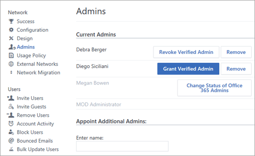

# Manage Yammer admins

Only users with appropriate roles can do administrative tasks in Yammer. Some roles are managed in Yammer, and some in Office 365.
  
Here are the available roles and what people assigned to them can do. Click the role name for a detailed list of tasks this role can do, and for steps to add and remove each role for a user.
  
|||
|:-----|:-----|
|**Role**   |**Business purpose**   |
|[Yammer group admin](manage-yammer-admins.md#bmk_group)   |Manage day-to-day activity in the group to keep the group engaged and productive, including monitoring group usage activity.    |
|[Office 365 report reader](manage-yammer-admins.md#bmk_reports)   |View reports showing overall Yammer usage. This role is helpful for anyone assigned to improve and monitor Yammer adoption.    |
|[Yammer network admin](manage-yammer-admins.md#bmk_network)   |Configure the network.    |
|[Verified admin](manage-yammer-admins.md#bmk_verified)   |Configure the network and do tasks with legal implications for the data stored in Yammer, such as configuring security settings, monitoring keywords for appropriate use, managing data retention, and exporting data.    |
|[Office 365 global admin](manage-yammer-admins.md#bmk_global)   |All the tasks a Yammer verified admin and Office 365 report reader can do, plus administration tasks for other Office 365 services.    |
   
You grant and change admin roles in the Yammer admin center. In the following screenshot, Debra Berger is a verified admin, Diego Siciliani is a network admin, and Megan Bowen is an Office 365 global administrator.
  

  

## Yammer group admin

|||
|:-----|:-----|
|**Tasks**   |Manage the settings for the group, including name, description, image, and header colors.    Manage the conversations and files in the group.    Manage members and group admins.    Post announcements   For instructions for typical tasks to manage a Yammer group, see [Manage a group in Yammer](https://support.office.com/article/6e05c6d6-5548-4c88-89cd-e6757a514ef2.aspx).    |
|**Who can give this role to others**   | Any Yammer user who creates a group is assigned the group admin role for the group automatically, and can add or remove other group admins. There is a limit of 100 group admins per group.    Verified admins can add or remove group admins in any groups.     Network admins can only add or remove group admins for groups they are a member of.     **Note:** Network admins and verified admins can disable the ability for Yammer users to create groups. In this case, they must assign the initial group admin, who then can do all group admin tasks for the group, including adding more group admins. For more information, see [Manage who can create Office 365 Groups](https://support.office.com/article/4c46c8cb-17d0-44b5-9776-005fced8e618).          |
|**Add or remove a group admin from a group**   | On the group page, in the upper right corner, click the **Settings** icon, click **Manage Members and Admins**, select a user, and then click either **Make Admin**, or **Revoke Admin**.    |
   

## Office 365 report reader

|||
|:-----|:-----|
|**Tasks**   | View usage reports for Yammer in the Office 365 usage reporting dashboard.     For information about accessing and interpreting reports, see  [Office 365 Reports in the Admin Center - Yammer activity report](https://support.office.com/article/C7C9F938-5B8E-4D52-B1A2-C7C32CB2312A) [Office 365 Reports in the Admin Center - Yammer groups activity report](https://support.office.com/article/94dd92ec-ea73-43c6-b51f-2a11fd78aa31) [Office 365 Reports in the Admin Center - Yammer device usage report](https://support.office.com/article/B793FFDD-EFFA-43D0-849A-B1CA2E899F38)    |
|**Who can give this role to others**   |This role is included in the Office 365 global admin role, and can be given to other users by an Office 365 global admin. For more information about this role, see [About Office 365 admin roles](https://docs.microsoft.com/office365/admin/add-users/about-admin-roles?view=o365-worldwide).    |
|**Add or remove a report reader role**   | In Office 365, go to **Admin** \> **Users** \> **Active Users** and select a user.   For details, see [Assign admin roles in Office 365 for business](https://support.office.com/article/eac4d046-1afd-4f1a-85fc-8219c79e1504).   |
   

## Yammer network admin

|||
|:-----|:-----|
|**Tasks**   | Configure network settings, including logo and colors, usage policy, what's included in user profiles.      Manage internal users and outside guests, unlisted groups     Grant and revoke network admin role     For groups they are in, anything group admins can do.     For instructions for typical tasks for network admins, see the [Yammer admin help](../yammer-landing-page.md).    |
|**Who can give this role to others**   |People with the Office 365 global admin role, and Yammer verified admins and network admins can give other Yammer users the network admin role.    |
|**Add a network admin**   | In the [Yammer admin center](https://go.microsoft.com/fwlink/?LinkId=524130), click **Admins**, and then in the **Appoint Additional Admins** section, enter the user's name.     Select **Make this user an admin**, and then click **Submit**.     **Remove a network admin**     In the [Yammer admin center](https://go.microsoft.com/fwlink/?LinkId=524130), click **Admins**, select the user's name, and then click **Remove**.    |
   

## Verified admin

|||
|:-----|:-----|
|**Tasks**   | All tasks a network admin can do, as well as:   - Assign verified and network admin roles.   - Manage content policies, including monitor keywords, data retention, security settings, and reading data in private groups.     - Export data   - Perform integrations with other tools      For instructions for typical tasks for verified admins, see the [Yammer admin help](../yammer-landing-page.md).    |
|**Who can give this role to others**   | An Office 365 global admin.       A Yammer verified admin.    |
|**Add or remove verified admins, without giving them the Office 365 global admin role**   |1. In the [Yammer admin center](https://go.microsoft.com/fwlink/?LinkId=524130), click **Admins**.   2. If the user is already a network admin, their name will show up in the **Current Admins** list. Select **Grant Verified Admin**.     If user is not already a network admin:      - In the **Appoint Additional Admins** section, search for them by name, and select **Make this user an admin**, and then click **Submit**.     - Find the user in the **Current Admin**s list, and click **Grant Verified Admin**.     **Change a verified admin who is not also an Office 365 global admin to be a network admin**     - In the [Yammer admin center](https://go.microsoft.com/fwlink/?LinkId=524130), click **Admins**, and in the **Current Admins** section, in the row for the admin, click **Revoke Verified Admin**.      **Remove all admin roles from a verified admin who is not also an Office 365 global admin**     In the [Yammer admin center](https://go.microsoft.com/fwlink/?LinkId=524130), click **Admins**, and in the **Current Admins** section, in the row for the admin, click **Remove**.    |
   

## Office 365 global admin

Anyone with the Office 365 global admin role is automatically a Yammer verified admin.
  
|||
|:-----|:-----|
|**Tasks**   | All tasks a verified admin can do, as well as:      - View reports in the Office 365 Usage Reporting dashboard.    -Add and remove the Office 365 global admin role and the Office 365 reports reader role from other users.     -  Manage other Office 365 services.    |
|**Who can give this role to others**   | Other people with the Office 365 global admin role.    |
|**Add or remove the Office 365 global admin role**   | To add an Office 365 global admin, see [Assign admin roles in Office 365 for business](https://support.office.com/article/eac4d046-1afd-4f1a-85fc-8219c79e1504).      **Remove another Office 365 global admin**     - In the [Yammer admin center](https://go.microsoft.com/fwlink/?LinkId=524130), click **Admins**, and in the row for the admin, click **Change Status of Office 365 Admins**. This takes you to the Office 365 page where you can change user's roles.    |
   

## Troubleshooting admin roles - FAQ

### Q: Can I change my own admin role for Yammer?

A: No. Admins can't edit their own roles.
  
### Q: How can I find out who the network and verified admins are for our network?

A: Non‐admin users can see all admins in the **Members** list in the **All Company** group. Admins have a  next to their name. They can also see a list of admins at **https://yammer.com/***your_network***/admin**.
  
Admins can view the list of admins: in the Yammer admin center, select **Admins**. Admins can also export a list of admins to review who has Network Admin role, and who has the Verified Admin role. In the Yammer admin center, select **Export Users**. In the exported .ZIP file, open **Admins.csv**. 
  
### Q: I'm an Office 365 global admin, and when I log on to Yammer, why don't I see any admin tools?

A: Check the following troubleshooting options to determine why your admin isn't receiving emails from Yammer:
  
1. Has the admin created a Yammer account?
    
    The Office 365 automated process syncs the Global Admin as a verified admin in Yammer, but the user must still create an account in Yammer to receive a confirmation email.
    
2. Is the admin on the correct domain?
    
    The user must have an email address that is in the same company domain that you've used to activate Yammer. If you create an admin in customer.uk, but the Yammer network you've activated is customer.com, the admin will not be synced as a Yammer Verified Admin. For more information on how to edit an admin's domain, see [Set up your Yammer network (Yammer activation guide)](https://support.office.com/article/e10998fe-f001-42f3-9597-b170d360f475).
    
3. Is the admin using a generic email?
    
    An admin cannot have a generic email address and must be assigned to a real user. To regulate this, there are certain words that are not allowed in the email address of a Global Admin:
    
      - admin, noreply, help, support, workfeed, feedback, yammer, api, abuse, postmaster, hostmaster, root, new, create, index, show, destroy, delete, and update
    
4. Has your company added Yammer.com to the Safe Recipients list?
    
    Your email service could be blocking emails from the Yammer domain. Please check to make sure Yammer.com is on a Safe Recipients list at your company and is not otherwise prevented from delivering emails.

