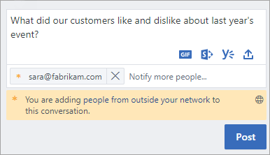
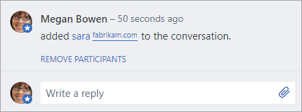

# Add external messaging participants to your Yammer conversations

Sometimes you need to communicate with outside partners, suppliers, or customers. You can add external participants to conversations in Yammer so that you can work with the people you need, even if they aren't in your Yammer network. For example, you can add external participants to a discussion or use instant messaging to quickly get a response. External participants can view and download files that have been uploaded to the conversation, and upload files. You'll be able to see when a conversation includes an external participant, and you can remove an external participant when you need to.
  
Here's how to work with external participants in Yammer:
  
- [Add an external participant](add-external-participants.md#AddExternal)
    
- [Remove an external participant from a conversation](add-external-participants.md#RemoveExternal)
    
- [How do external participants reply?](add-external-participants.md#ExternalReply)
    
## Add an external participant

As a Yammer user, you can add an external participant to a discussion, and you can send a private message or instant message with an external participant.
  
 **Add an external participant to a discussion**
  
1. In Yammer, type your message or reply to an existing message.
    
2. On the Cc line, type the email address of the person you want to invite to the conversation.
    
    
  
    When you add an external participant, you'll see a notification confirming that you are adding someone to the conversation.
    
3. Choose **Post** to send your message. 
    
    
  
    The external participant's name and email address appears.
    
    For all future messages in the conversation, the globe symbol is added, along with a note that your reply will be visible to people outside your network.
    
    
  
 **Send a private message to an external participant**
  
1. In Yammer, choose **Inbox**.
    
2. Choose **Create Message**.
    
    
  
3. Select **Send via Private Message**, and in the **Add participants** box, add the email address of the person you want to add as an external participant. 
    
    
  
    When you add an external participant, you'll see a notification containing a globe icon, confirming that you are adding someone to the conversation.
    
4. Choose **Send Message** to send your message. 
    
## Remove an external participant from a conversation

You can remove an external participant from a conversation. When you remove them, they can no longer see that conversation in their Yammer inbox. However, their comments remain in the conversation.
  
Who can remove external participants?
  
- **All members** of a network can remove individual external participants that they have added to a conversation or private message. 
    
    **The conversation starter** can remove all external individual participants that they have added to a conversation. 
    
- **Group admins** can remove all external participants from conversations in groups that they administer. 
    
- **Verified admins** of a network can remove all external participants from any conversation. 
    
**Remove an external participant from a conversation**
  
1. Within the comment announcing that an external participant has been added to the conversation, click **Remove Participants** for the member you would like to remove. 
    
    
  
2. On the confirmation message "Are you sure you want to remove those people from the conversation?", choose **OK**.
    
Verified admins can find all external participants in a Network. See [Find external participants in a Yammer network](find-external-participants.md).
  
## How do external participants reply?

External participants get an email inviting them to Yammer. They can accept the invitation and go to the Yammer registration page to sign up for their organization's Yammer network.
  
They also get an email with the body of the conversation or message. They can reply to the email to contribute to the discussion, or they can click the link to **Reply on Yammer**. If they choose to **Reply on Yammer**, they'll go to the Yammer registration page.
  
If an external participants no longer wants to participate, they can unsubscribe from a conversation by using either:
  
- **Email:** choose the **Unsubscribe from this conversation** link in their email message. 
    
- **Yammer inbox:** choose **Stop following in inbox** for the conversation in their Yammer inbox. 
    
## See also

[Find external participants in a Yammer network](find-external-participants.md)
  
[External Yammer participants FAQ](external-messaging-faq.md)
  
[Disable external messaging in a Yammer network](control-external-messaging-with-exchange.md)