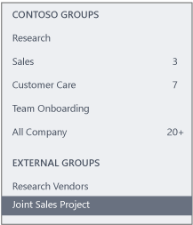

# Work with external groups in Yammer networks not aligned to native mode

You can work with external users in Yammer if your network isn’t aligned to native mode by creating an external group. You can also limit and turn off collaboration in external groups.

This experience differs from working with the Yammer guest experience, which is powered by Azure Active Directory B2B and requires native mode. For a comparison of experiences, see [Collaborate with guests in a Yammer community]((../work-with-external-users/collaborate-guests-external-yammer-community.md).

## Create and manage external groups in Yammer

You can create a group that includes external users, which is called an external group. You must create the group as an external group - you can't change an existing internal group to be an external group.
  
The group admin can add external users to the group. In public external groups, other users in the group can suggest adding an external user, but the group admin has control over whether that user is added, and has to approve the addition. In private external groups, only the admin can add external members.
  
External groups look different than internal Yammer groups, so you can easily distinguish which groups have external participants. The group header for an external group shows that additional networks are participating in the group.
  

  
External groups are marked with a globe icon in the left navigation.
  

  
Users invited to participate in an external group hosted on a different network are required to accept the invitation before being able to view any content in the group.

>[!NOTE] 
>This feature is not available for Yammer Enterprise networks in Native Mode or the [EU Geo](../manage-security-and-compliance/data-residency.md).
  
## Create an external group

When you create a group, you can decide if it is an internal or external group. You can't change this setting after you create the group.
  
1. In Yammer, under the list of groups, select **Create Group**.
    
    The **Create A New Group** dialog box opens. If your network allows external groups, you'll see options to create an Internal Group or External Group: 
    
    
  
2. Select **External Group**.
    
3. Type a name in the **Group Name** box. 
    
4. Type the names of people to add to the group in the **Group Members** box. 
    
5. Choose who can view conversations and post messages.
    
   - For a public group, select **Approved members from other networks and anyone in this network**.
    
   - For a private group, select **Only group members**.
    
6. Click **Create Group**.
    
You can find external groups in your network the same way you find external users. For more information, see [Find external messaging participants in a Yammer network](find-external-participants.md).

## Find external messaging participants in a Yammer network

When you communicate with outside partners, suppliers, or customers, you want to make sure only authorized personnel have access to the information on your Yammer network. Verified admins can use data export to find the names of [external participants](add-external-participants.md) to see which conversations and files in their network are visible to external participants.

>[!NOTE] 
>Yammer Enterprise networks in the [EU Geo](../manage-security-and-compliance/data-residency.md) do not have external participants.

1. In the Yammer admin center, go to **Content and Security** \> **Export data**.

    You'll only see this option if you are a verified admin in the Yammer network.

    For more information, see [Export Yammer Enterprise data](../manage-security-and-compliance/export-yammer-enterprise-data.md).

2. To identify **threads in your network that users from other networks participate in**, locate the export folder on your computer, and open the **MessageThreads.Outbound.csv** export file.

    >[!NOTE]
    >The data export reflects the current view of the network. For example, if a user was added, but then removed before the report was created, that user won't appear in the report.
  
    > [!div class="mx-imgBorder"]
    > 
  
    Column **D** (external_participants) lists the users in other networks that participate in threads in your network, along with their name, email address, and the network ID of the Yammer network they belong to.

If you want to remove an external participant, you can use the information from the list to go to the conversation they're included in and remove them from the conversation. 

## Disable external messaging in a Yammer network

By default for Yammer Enterprise networks in the US Geo, users can add external participants to their Yammer conversations and Yammer communities and groups, and members of your Yammer network can participate in another company's Yammer network if invited. If needed, you can turn off this external collaboration.

1. In the Yammer admin center, go to **Content and Security** \> **Security Settings**.
    
2. In the **External Messaging** section, select the option that makes sense for your organization: 

     -  **Allow users in this network to participate in groups or conversations in other networks, and allow external users to participate in groups or conversations in this network.**    
   
     - **Allow users in this network to participate in groups or conversations in other networks, but don't allow external users to participate in groups or conversations in this network.**     
   
     - **Don't allow users in this network to participate in groups or conversations in other networks, and don't allow external users to participate in groups or conversations in this network.**

 ## What each option does

| Option | Users can participate in other networks 1 | External participants can participate in groups and conversations 2 |
|--------|-------------------------------|----------------|
|**Allow users in this network to participate in groups or conversations in other networks, and allow external users to participate in groups or conversations in this network.**| Yes | Yes|
|**Allow users in this network to participate in groups or conversations in other networks, but don't allow external users to participate in groups or conversations in this network.** | Yes | No|
|**Don't allow users in this network to participate in groups or conversations in other networks, and don't allow external users to participate in groups or conversations in this network.**| No | No|

1. When you prevent users from being able to participate in other networks:

    - Users are blocked from receiving invitations from Yammer networks on other domains.

2. When you disable external access to your groups and conversations:

    - When a user tries to add an external participant in Yammer, the user receives an error message stating that they are unable to add external participants because it violates their company's policy. The user will not be allowed to post the message. 

    - Any current external participants are blocked from using external conversations or threads that they may have been participating in.

    - No new external groups can be created. 

## FAQ

### Q: Why don't I see an option for creating an external group?

A: If your administrator opted out of allowing external messaging, you won't be able to create external groups.
  
### Q: Can I create an external group on an external network?

A: No. The creation of external groups is limited to canonical networks and is not available on external networks.

### Q: Are there differences in working with messages in external groups?

A: Yes. In external groups, you can't edit or move messages, or add a topic or a bookmark. 
  
## Related articles

[External messaging FAQ (Yammer)](external-messaging-faq.md)

[Add external participants to your Yammer conversations](add-external-participants.md)
