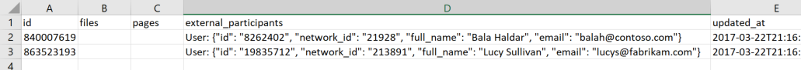

# Find external messaging participants in a Yammer network

Your users need the flexibility to [add external participants](add-external-participants.md) to conversations in your Yammer network. As an admin, you need to know who those participants are and what they're saying in case you need to make a change. Verified Admins can see which conversations and files in their network are visible to external participants and can identify conversations in which their employees are participating on other Yammer networks. This article helps you find the external participants in your Yammer network so you can stay in control. 
  
If you are a verified admin, you can use the data export tool to find external participants in your network and find conversations that your users are participating in on other networks.
  
1. In the Yammer admin center, go to **Content and Security** \> **Export data**.
    
    You'll only see this option if you are a Verified Admin in the Yammer network.
    
    For more information, see [Export Yammer Enterprise data](../manage-security-and-compliance/export-yammer-enterprise-data.md).
    
2. To identify **threads in your network that users from other networks participate in**, locate the export folder on your computer, and open the **MessageThreads.Outbound.csv** export file. 
  

  
Column **D** (external_participants) lists the users in other networks that participate in threads in your network, along with their name, email address, and the network ID of the Yammer network that they belong to. The data export reflects the current view of the network. If a user was added but removed before the report was created, that user won't appear in the report. 
    
If you want to remove an external participant, you can use the information from the list to go to the conversation that they're included in and remove them from the conversation. See [Remove an external participant from a conversation](add-external-participants.md#RemoveExternal).
  
## See also

[Add external participants to your Yammer conversations](add-external-participants.md)
  
[External Yammer participants FAQ](external-messaging-faq.md)
  
[Disable external messaging in a Yammer network](control-external-messaging-with-exchange.md)